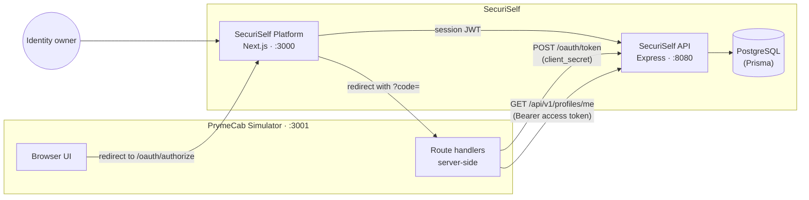

# SecuriSelf

SecuriSelf is a contextual identity-management prototype. An identity owner keeps
their root personal data in a private **Identity Vault** and defines
purpose-specific identity **Contexts** (for example a professional profile or a
legal identity). A third-party application never reads the Vault: it receives
only the one Context the owner selected and approved, filtered by the SecuriSelf
API according to that Context's category.

## Core Idea

```
Identity Vault → Context → owner consent → authorization code
  → context-bound access token → Profile API → filtered identity → Activity record
```

1. The owner stores root data in the Vault and creates Contexts.
2. A registered Client redirects the owner to SecuriSelf to request access.
3. The owner picks one Context and approves; SecuriSelf issues a short-lived,
   single-use authorization code to the Client's registered redirect URI.
4. The Client's server exchanges the code, with its `client_secret`, for an
   opaque access token bound to that owner, Client and Context.
5. `GET /api/v1/profiles/me` returns only the fields the Context's category
   allows. Grants, profile reads, revocations and failed exchanges of an issued
   code are recorded.

## Repository Structure

```
apps/
  api-backend/           SecuriSelf API: Express + Prisma, all authorization and filtering
  securiself-platform/   SecuriSelf Platform: Next.js owner Console, consent screen, Developer Docs
  prymecab-simulator/    PrymeCab: Next.js third-party app that consumes SecuriSelf
tests/
  e2e/                   Playwright browser tests across all three apps (incl. accessibility)
playwright.config.ts     Starts the API, Platform and PrymeCab for E2E runs
turbo.json               Turborepo task pipeline (dev, build, lint, check-types)
```

The workspace is managed with pnpm and Turborepo (`pnpm-workspace.yaml`).

## Architecture



| Component | Responsibility |
| --- | --- |
| **SecuriSelf API** (`apps/api-backend`) | Owner authentication (email/password and Google), Vault, Contexts, Client registration, the authorization-code flow, the Profile API, Grants and the Activity (audit) log. All privacy filtering happens here. |
| **SecuriSelf Platform** (`apps/securiself-platform`) | Owner-facing Console (Vault, Contexts, Clients, Grants, Activity, Settings), the consent screen at `/oauth/authorize`, and the in-product Developer Docs at `/console/docs`. It talks to the API only and has no database of its own. |
| **PostgreSQL / Prisma** | Persistence. Schema: `apps/api-backend/prisma/schema.prisma`. |
| **PrymeCab Simulator** (`apps/prymecab-simulator`) | An example third-party Client. The code exchange and profile reads run in Next.js route handlers, so `client_secret` and the access token stay server-side; the access token is kept in an `httpOnly` cookie. |

**Trust boundary.** PrymeCab never reads the Vault or the database. Disclosure is
mediated by owner consent, a code bound to the Client and redirect URI, an access
token bound to one Context, and the API's per-category allow-list in
`apps/api-backend/src/modules/profiles/profiles.service.ts`.

## Main Capabilities

- Private Identity Vault (legal name, display name, gender, avatar) alongside the account email.
- Four Context categories — `PROFESSIONAL`, `LEGAL`, `SOCIAL`, `PRIVATE` — each with
  a fixed disclosure allow-list and category-specific validation.
- Client registration with a one-time-displayed `client_secret` and secret rotation.
- Consent screen with Context selection, a payload preview and a "Not shared" list.
- Authorization-code exchange and opaque, context-bound access tokens.
- Privacy-filtered Profile API (`GET /api/v1/profiles/me`).
- Grants listing and revocation, which invalidates the Grant's tokens and unused codes.
- Activity log: `ACCESS_GRANTED`, `PROFILE_READ`, `TOKEN_EXCHANGE_FAILED`, `ACCESS_REVOKED`.
- English/Spanish variants for `pronouns`, `job_title` and `short_bio`, selected by
  `Accept-Language` with per-field fallback to English.
- Optional Google Sign-In for identity owners (links to an existing account by
  verified email; Google name and picture are not copied into the Vault).
- In-product Developer Docs for integrating a Client.
- PrymeCab, a reference external Client.

## Technology Stack

- TypeScript, pnpm workspaces, Turborepo
- API: Node.js, Express 5, Prisma 7 (PostgreSQL via `@prisma/adapter-pg`), Zod,
  jsonwebtoken, bcrypt, helmet, google-auth-library
- Platform: Next.js 16 (App Router), React 19, Tailwind CSS 4, shadcn/ui (Radix),
  TanStack Query, Zustand, React Hook Form
- PrymeCab: Next.js 16, React 19, Tailwind CSS 4
- Testing: Vitest, Supertest, Testing Library, Playwright, axe-core

## Prerequisites

- Node.js `^20.19 || ^22.12 || >=24` (the range required by Prisma 7; Next.js 16
  needs `>=20.9`)
- pnpm 9 (`packageManager: pnpm@9.0.0`)
- A PostgreSQL database. The backend tests and the E2E suite each need their own
  database, separate from the development one.

## Environment Setup

Each app has a template containing placeholder values only:

```bash
cp apps/api-backend/.env.example          apps/api-backend/.env
cp apps/securiself-platform/.env.example  apps/securiself-platform/.env.local
cp apps/prymecab-simulator/.env.example   apps/prymecab-simulator/.env.local
cp .env.e2e.example                       .env.e2e     # only for the E2E suite
```

| File | Key variables |
| --- | --- |
| `apps/api-backend/.env` | `DATABASE_URL`, `TEST_DATABASE_URL`, `JWT_SECRET`, `PORT` (8080), `CORS_ORIGIN`, `AUTH_CODE_TTL_MINUTES`, `ACCESS_TOKEN_TTL_HOURS`, optional `GOOGLE_CLIENT_ID` |
| `apps/securiself-platform/.env.local` | `NEXT_PUBLIC_API_URL`, optional `NEXT_PUBLIC_GOOGLE_CLIENT_ID` |
| `apps/prymecab-simulator/.env.local` | `NEXT_PUBLIC_API_URL`, `NEXT_PUBLIC_SECURISELF_AUTHORIZE_URL`, `NEXT_PUBLIC_REDIRECT_URI`, `NEXT_PUBLIC_CLIENT_ID`, `CLIENT_SECRET` |
| `.env.e2e` | `E2E_DATABASE_URL`, `ALLOW_E2E_DB_RESET`, `JWT_SECRET`; seeded fixtures live in `tests/e2e/fixtures/test-data.ts` |

Google Sign-In is optional and no Google credentials are included. The Platform
shows the Google button only when `NEXT_PUBLIC_GOOGLE_CLIENT_ID` is set, and the
API answers `POST /api/v1/auth/google` with `503` when `GOOGLE_CLIENT_ID` is
empty; email/password sign-in is unaffected. To enable it, set both variables to
the same OAuth 2.0 Web client ID.

PrymeCab's `NEXT_PUBLIC_CLIENT_ID` and `CLIENT_SECRET` come from registering
PrymeCab in the Console (see [Demonstration Flow](#demonstration-flow)).

## Installation

```bash
pnpm install
```

## Database Setup

The project applies its schema with `prisma db push`; there is no migration
history. With `DATABASE_URL` set in `apps/api-backend/.env`:

```bash
pnpm --filter api-backend prisma:generate   # generate the Prisma client
pnpm --filter api-backend prisma:push       # create/sync tables in DATABASE_URL
```

The test and E2E databases are prepared automatically by their test runners.

## Running SecuriSelf

```bash
pnpm dev
```

This starts all three apps through Turborepo:

| App | URL | Command |
| --- | --- | --- |
| SecuriSelf API | http://localhost:8080 (`GET /health`) | `pnpm --filter api-backend dev` |
| SecuriSelf Platform | http://localhost:3000 | `pnpm --filter securiself-platform dev` |
| PrymeCab Simulator | http://localhost:3001 | `pnpm --filter prymecab-simulator dev` |

A production build is available through `pnpm build`.

## Demonstration Flow

1. Run `pnpm dev`.
2. Open http://localhost:3000/sign-up and create an account.
3. **Vault**: enter a legal first and last name.
4. **Contexts → Create Context**: create, for example, a `SOCIAL` Context (display name or
   username) and a `LEGAL` Context (document ID).
5. **Clients → Register Client**: name `PrymeCab`, redirect URI
   `http://localhost:3001/api/auth/callback`. Copy the client ID and the
   one-time client secret into `apps/prymecab-simulator/.env.local`, then
   restart PrymeCab.
6. Open http://localhost:3001 and choose **Login with SecuriSelf**.
7. On the consent screen, select a Context. The preview shows exactly what
   PrymeCab will receive; the "Not shared" list names what it will not.
8. Approve. PrymeCab shows the Context-filtered profile. The account email never
   appears, and legal name/document ID appear only for a `LEGAL` Context. If the
   Context has Spanish variants, the EN/ES toggle switches them.
9. In the Console, **Activity** shows `Access granted` and `Profile read`;
   **Grants** lists the PrymeCab permission.
10. Revoke the Grant, then reload PrymeCab: it reports that the previous access
    is no longer available, and the old token is rejected with `401`.

## Testing

| Command | Covers |
| --- | --- |
| `pnpm test:backend` | Vitest + Supertest against a real PostgreSQL (`TEST_DATABASE_URL`): auth, Vault, Contexts, per-category filtering and forbidden-field leakage, code expiry/replay/concurrent exchange, redirect URI and client-secret checks, bearer-token validation, cross-user ownership, revocation, audit events, localization, Google sign-in. |
| `pnpm test:platform` | Platform component and unit tests (Vitest, jsdom): consent labels, Grants UI, Context forms and payload preview, API client, Google session handling, Developer Docs content. |
| `pnpm test:prymecab` | PrymeCab unit tests: access-state mapping and Profile API request headers. |
| `pnpm test:e2e` | Playwright across all three apps: SOCIAL/LEGAL disclosure, consent denial, Vault/profile privacy boundary, Grant revocation, localization, Developer Docs, Console keyboard usability. |
| `pnpm test:a11y` | Playwright specs tagged `@a11y`: axe-core (WCAG 2.1 A/AA; fails on critical/serious) plus keyboard and focus checks. |
| `pnpm lint` / `pnpm check-types` | ESLint (Next.js apps) and TypeScript for all apps. `pnpm test:quality` runs both. |
| `pnpm build` | Production build of all apps. |
| `pnpm test:all` | All of the above except `build`, in sequence. |

`check-types` needs the generated Prisma client (see
[Database Setup](#database-setup)).

**Backend tests** need `TEST_DATABASE_URL` in `apps/api-backend/.env`. The global
setup creates the database if it is missing, pushes the schema, and every test
truncates all tables.

**E2E and accessibility tests** need `.env.e2e`, a Chromium install
(`pnpm exec playwright install chromium`), and free ports 3000, 3001 and 8080.
`pnpm test:e2e:prepare` (run automatically) seeds a fixed owner, four Contexts
and the PrymeCab client, and builds both Next.js apps. The reset script
(`tests/e2e/setup/prepare-e2e.ts`) truncates the E2E database and refuses to run
against the development `DATABASE_URL` from `apps/api-backend/.env`. It also
requires test/E2E mode and `ALLOW_E2E_DB_RESET=true`, but the `pnpm` scripts set
both, so a separate E2E database is the effective safeguard. Reports are written
to `playwright-report/` (`pnpm test:e2e:report`).

## Developer Integration

The Platform includes Developer Docs at `/console/docs` (sign-in required). They
cover Client registration, the authorization request, the code-to-token
exchange, the Profile API, per-Context payloads, localization, Grants and
revocation, error responses, and PrymeCab as a reference integration.

| Endpoint | Auth | Purpose |
| --- | --- | --- |
| `GET /oauth/authorize?client_id&redirect_uri&response_type=code&scope=identity_context` | Owner session | Consent-screen data (used by the Platform) |
| `POST /oauth/authorize/decision` | Owner session | Approve or deny; approval returns `{ redirectTo }` with `?code=` |
| `POST /oauth/token` | `client_id` + `client_secret` | Exchange a code for `{ access_token, token_type, expires_in }` |
| `GET /api/v1/profiles/me` | `Bearer` access token | Context-filtered profile; optional `Accept-Language: en \| es` |

The Console uses `/api/v1/auth`, `/vault`, `/contexts`, `/clients`, `/grants` and
`/audit-logs` with a session JWT.

## Security and Privacy Design Notes

- **Server-side filtering.** `filterProfile` builds each response from a fixed
  per-category field list; the account email, gender, password hash and Google
  subject are never returned, and legal name and document ID only for `LEGAL`.
- **Context-bound tokens.** Each access token belongs to exactly one owner,
  Client and Context. Tokens are random 32-byte values stored only as SHA-256
  hashes, and are checked for expiry and revocation on every request.
- **Authorization codes** are single-use (consumed atomically in a transaction),
  expire after `AUTH_CODE_TTL_MINUTES`, and are accepted only from the Client they
  were issued to, with the exact registered redirect URI.
- **Client secrets** are bcrypt-hashed and displayed once. PrymeCab keeps
  `client_secret` in server-side code; the browser only carries the code.
- **Exact redirect URI matching** at both authorization and token exchange.
- **Owner-scoped resources.** Contexts, Clients and Grants are checked against the
  session owner (`403` for another owner's resource).
- **Revocation** marks the Grant revoked, revokes its access tokens, retires its
  unexchanged codes and records `ACCESS_REVOKED` in one transaction. A new
  consent is required to restore access.
- **Audit trail.** Consent, profile reads, revocations and failed exchanges of an
  issued code (with a reason) are recorded per owner and shown in Activity. A
  request with an unknown `client_id` or code has no owner to attribute and is
  rejected without an audit record.

## Project Scope

SecuriSelf is an academic prototype. Its authorization-code flow follows the
shape of OAuth 2.0 to demonstrate the Context-based disclosure model; it is not a
certified OAuth 2.0 or OpenID Connect implementation and has not been hardened
for production use. The Platform stores the owner's session token in
`localStorage`, and there are no refresh tokens.
