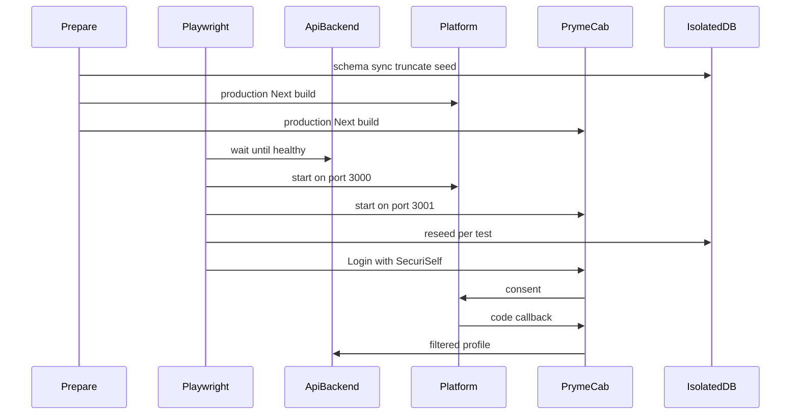

# Sprint 1 final summary

SecuriSelf — automated browser-level End-to-End validation of the existing disclosure path  
Technical record of what was implemented and validated after the Feature Prototype.  
Sources: [`SPRINT1-IMPLEMENTATION.md`](./SPRINT1-IMPLEMENTATION.md), [`SPRINT1-VALIDATION.md`](./SPRINT1-VALIDATION.md), the Sprint 1 Playwright helpers, and [`docs/sprint1/images/`](./images/).

This is a consolidated source for a later academic write-up. It is not the academic Sprint report.

---

## 1. Sprint objective

After the Feature Prototype, SecuriSelf already disclosed a selected **Context** — a purpose-bound subset of identity, such as Social or Legal — through three applications:

1. PrymeCab (the consuming application) starts Login with SecuriSelf.
2. The Platform shows consent, where the identity owner picks a Context and approves or denies.
3. On approval, PrymeCab exchanges the authorisation code and renders the filtered profile from the API.

Backend automated tests already checked filtering, token exchange, ownership, and related API rules against PostgreSQL. Those tests are at the **API boundary**: they prove what the server will accept or refuse without a browser.

What they could not observe was the **integrated user journey**: the real redirect chain in a browser, the visible consent decision, the filtered profile as PrymeCab actually renders it, and Activity after a grant is created or revoked from that session. Until Sprint 1, that chain depended primarily on manual browser verification.

**End-to-End (E2E) testing** here means automated tests that start from a user’s entry point and follow the same sequence through more than one application. **Browser automation** means a tool launches a real browser, clicks and types as a user would, and then inspects the resulting pages and the HTTP responses those pages trigger.

Sprint 1 did not rebuild disclosure. It added Playwright so Chromium could drive PrymeCab and the Platform together while the API served an isolated test database, plus automated accessibility checks on the same stack.

The question was:

> Can SecuriSelf’s important cross-application browser journeys be exercised and checked automatically and repeatably, instead of depending primarily on manual browser verification?

That is a different level of the system from the existing backend tests. Those tests remained necessary; they were not replaced.

---

## 2. What Sprint 1 implemented

### Playwright E2E layer

Playwright is the integrated-system runner. A scenario launches Chromium, follows cross-origin redirects, and then inspects both the rendered UI and the HTTP responses those pages trigger (PrymeCab’s profile route, Platform Activity).

That made it possible to check, after a real consent click, that PrymeCab never receives the vault email, that Deny leaves no usable authorisation code, and that Activity reflects a grant that was just created or revoked in the browser. Backend tests can assert the same privacy rules as JSON; they cannot watch the redirect chain or the on-screen result.

Root commands introduced for this:

- `pnpm test:e2e:prepare` — schema sync, truncate/seed of an isolated database, production builds of Platform and PrymeCab
- `pnpm test:e2e` — prepare, then Playwright excluding accessibility-tagged specs
- `pnpm test:a11y` — prepare, then only the accessibility-tagged specs

The same iteration also expanded backend Vitest coverage (ownership, lifecycle, audit). That sits at the API layer already used by the Feature Prototype. It is complementary, not the Sprint’s main addition.

### Test environment and isolation

**Test isolation** means each scenario starts from a known owner, four Contexts, and one PrymeCab client, so one test cannot leave a grant or audit row that another test still needs.

Mechanisms that make that repeatable:

- **Deterministic seed data** so Social, Legal, and forbidden-field lists are the same every run.
- **Isolated PostgreSQL** so truncation never targets development data by accident.
- **Prepare then per-test reseed** so schema is synced once, then identity tables are reset before every scenario.
- **Three process startups** (API, Platform, PrymeCab) so a click can actually leave PrymeCab, land on the Platform, and return.
- **Serial workers** because specs share one seeded user and client; parallel runs would race over the same grant.
- **Reset guards** so the process must identify as E2E/test, `ALLOW_E2E_DB_RESET` must be set, and the target URL must not match the development database URL.

Production `next start` is used instead of `next dev` because long suites were observed to corrupt Turbopack caches.

### Accessibility automation

An **accessibility scan** is an automated pass over the rendered page against coded rules related to WCAG 2 / 2.1 A and AA. Sprint 1 used `@axe-core/playwright` as a **separate tagged suite**, not as extra assertions mixed into every journey spec.

Axe does not operate the consent radios or prove that Approve/Deny can receive keyboard focus. Those checks are explicit Playwright steps in the same suite (focus, Enter on a radio, `aria-checked`). The project gate fails on **critical** and **serious** impact; moderate and minor findings are recorded as advisory rather than hidden.

Sprint 1 did not add Grants console UI, UI-driven revoke, or language-specific Context fields.

---

## 3. How the implementation works

An automated scenario can start in PrymeCab, move into SecuriSelf consent, return to PrymeCab, and check the result because preparation, process startup, and per-test reset are wired together.



1. **Prepare** an isolated database: sync schema, truncate identity tables, seed one owner, four Contexts, and the PrymeCab client, then production-build the two Next.js apps.
2. **Start** the API, Platform (`localhost:3000`), and PrymeCab (`localhost:3001`). Playwright waits until each URL responds.
3. **Open Chromium** and reseed before the scenario so leftover grants cannot leak in.
4. **Reproduce the journey**: open PrymeCab, click Login with SecuriSelf, sign in if the Platform asks, wait until consent copy and the registered redirect URI are visible, select a Context, approve or deny.
5. **Inspect** the visible UI and the HTTP responses those pages trigger (PrymeCab profile with the browser cookie, Activity after navigating the Platform).
6. **Reset** before the next scenario.

Approval waits until the browser is back on PrymeCab. Deny stays on the Platform with an “Access denied” state and no authorisation code in the URL.

**Revocation in Sprint 1.** There was no Grants page to click. After Social consent, the spec reads the Platform session from `localStorage` (origin-scoped, so this happens while still on the Platform), calls the existing Grants API to revoke, then checks that PrymeCab’s profile request is unauthorised, the landing login control returns, and Activity shows “Access revoked”.

---

## 4. Important implementation code

Five pieces are enough to understand why the browser layer is reliable. File names follow the explanation; a reviewer does not need the rest of the tree.

### Multi-application startup

File: `playwright.config.ts`

```ts
webServer: [
  {
    command: "pnpm --filter api-backend exec tsx src/index.ts",
    url: `${E2E_ORIGINS.api}/health`,
  },
  {
    command: "pnpm --filter securiself-platform exec next start -p 3000",
    url: E2E_ORIGINS.platform,
  },
  {
    command: "pnpm --filter prymecab-simulator exec next start -p 3001",
    url: E2E_ORIGINS.prymecab,
  },
],
```

**What problem it solves.** Disclosure is cross-origin by design (PrymeCab → Platform → API). A single-app Playwright config could not follow that redirect or prove that the browser talks to the Platform rather than calling the API origin directly.

**How it works.** Playwright starts each command, polls the `url`, and only then runs specs ([webServer](https://playwright.dev/docs/test-webserver)). Platform and PrymeCab run as production servers; the API still receives the isolated database URL.

**Why it matters to Sprint 1.** Without three live origins, “Login with SecuriSelf” cannot become a real consent screen and a real callback.

**What could go wrong without it.** Specs would hit a missing app, or a developer would have to start the three processes by hand — which is the manual verification Sprint 1 was meant to replace.

### Safe isolated-database preparation

File: `tests/e2e/setup/prepare-e2e.ts`

```ts
if (developmentUrl && normalizeUrl(developmentUrl) === normalizeUrl(targetUrl)) {
  throw new Error(
    "Refusing E2E DB reset: target URL matches development DATABASE_URL",
  );
}
```

**What problem it solves.** Preparation issues `TRUNCATE … CASCADE`. The same Prisma models are used in local development.

**How it works.** Reset is refused unless the process is marked as test/E2E, `ALLOW_E2E_DB_RESET=true` is set, and the target URL is not the development database URL.

**Why it matters to Sprint 1.** Repeatable browser tests require wiping grants and audit rows. That wipe must never land on a developer’s working database.

**What could go wrong without it.** A copied environment file could truncate development identity data.

### Per-test reseed

File: `tests/e2e/fixtures/test.ts`

```ts
export const test = base.extend({
  reseedDatabase: [
    async ({}, use) => {
      runPrepareE2E({ skipSchemaSync: true });
      await use(undefined);
    },
    { auto: true },
  ],
});
```

**What problem it solves.** Consent, denial, and revocation all write grants, tokens, or audit rows. Shared seed without reset would make later scenarios order-dependent.

**How it works.** Every journey spec imports this `test`, not Playwright’s default. The auto fixture reseeds before each test (schema sync skipped). Workers are serial (`workers: 1`) so two tests cannot revoke the same grant at once.

**Why it matters to Sprint 1.** Privacy and Activity assertions are only meaningful if the previous scenario cannot leave a PROFILE_READ or an active grant behind.

**What could go wrong without it.** A denial spec could see a grant from a previous approval, or revocation could fail because two tests shared one token.

### Shared consent-flow helper

File: `tests/e2e/helpers/oauth-flow.ts`

```ts
export async function reachConsentScreen(page: Page): Promise<void> {
  await openPrymeCabLanding(page);
  await startLoginWithSecuriSelf(page);
  await expect(signInMarker.or(consentMarker)).toBeVisible({ timeout: 30_000 });
  if (await signInMarker.isVisible()) {
    await signInAsE2EOwner(page);
  }
  await expect(consentMarker).toBeVisible({ timeout: 30_000 });
}
```

**What problem it solves.** Production hydration can briefly open the authorise URL before bouncing to sign-in. Waiting only on a URL races that bounce.

**How it works.** The helper is written against **visible markers**: PrymeCab landing, then either the sign-in copy or the consent copy. If sign-in is showing, it fills the seeded owner and continues until consent and the registered redirect URI are visible.

**Why it matters to Sprint 1.** Social, Legal, denial, privacy, revocation, and accessibility all enter the product the same way a user does. One helper keeps that path consistent.

**What could go wrong without it.** Specs would flake on hydration, or each file would invent a slightly different click sequence that no longer matches the real journey.

### Accessibility scan gate

File: `tests/e2e/helpers/accessibility.ts`

```ts
const AXE_TAGS = ["wcag2a", "wcag2aa", "wcag21a", "wcag21aa"] as const;

let builder = new AxeBuilder({ page }).withTags([...AXE_TAGS]);
const results = await builder.analyze();
const blocking = results.violations.filter(
  (v) => v.impact === "critical" || v.impact === "serious",
);
expect(blocking).toEqual([]);
```

**What problem it solves.** Journey specs prove disclosure behaviour; they do not scan pages for coded accessibility failures. Mixing axe into every journey would also hide whether a failure came from privacy logic or from a page scan.

**How it works.** [`AxeBuilder.withTags`](https://github.com/dequelabs/axe-core-npm/blob/develop/packages/playwright/README.md) limits the rule set to WCAG 2 / 2.1 A and AA. Only critical and serious impact fails the test; moderate and minor findings are attached as advisory output. A separate helper focuses a named control and asserts it is focused; consent radios are selected with Enter and checked via `aria-checked`.

**Why it matters to Sprint 1.** The accessibility suite is a regression gate on the same surfaces the E2E journeys use, without claiming WCAG conformance.

**What could go wrong without it.** A serious axe finding on consent or sign-in could ship unnoticed, or keyboard operability of Approve/Deny would never be exercised because axe does not click those controls.

---

## 5. What the automated testing covered

Coverage is the behaviour under test, not the names of spec files.

**Social Context disclosure.** After the owner selects Social and approves, PrymeCab receives only the Social payload. Vault email, legal identity, and professional fields must not appear in the consent preview, the PrymeCab UI, or the profile response. Activity must show a profile read. Before approval, PrymeCab must have no contextual profile.

**Legal Context disclosure.** After Legal is approved, PrymeCab shows legal names and document id. Vault email and Social/Professional fields must not appear.

**Consent denial.** After a Context is selected and Deny is used, no authorisation code is issued, PrymeCab still has no profile, the Platform shows that access was denied, and audit does not record access granted or a profile read.

**Privacy boundary.** The Vault still holds the owner email. Social and Legal third-party payloads never include it. The Legal half runs in a fresh browser context so the Social grant is not reused.

**Historical grant revocation.** After Social disclosure, the active grant is revoked through the Grants API using the Platform session already in the browser. PrymeCab’s profile request then fails, login returns, and Activity shows access revoked. The later Grants console UI was not part of this sprint and was not used as Sprint 1 evidence.

**Activity / audit observation.** After disclosure, Activity shows a profile read for PrymeCab. After revoke, it shows access revoked.

**Automated accessibility scanning.** Public landings, sign-in/sign-up, the authenticated console routes that existed in Sprint 1, consent, and post-approval PrymeCab were scanned with the axe tags and impact gate above.

**Keyboard, focus, and semantic checks.** Sign-in and Login with SecuriSelf can receive keyboard focus. On consent, a Context radio can be focused, selected with Enter, and reports `aria-checked="true"`. Deny and Approve can receive keyboard focus.

---

## 6. How Sprint 1 was evaluated

Evaluation was **automated technical evaluation**, recorded in [`SPRINT1-VALIDATION.md`](./SPRINT1-VALIDATION.md).

The historical Sprint 1 browser scenarios were executed again against the current repository, limited to that historical scope. Later Grants-UI revocation and multilingual Context tests were not run as Sprint 1 evidence.

Pass/fail criteria were the assertions in those scenarios: HTTP 401 before consent and after revoke, filtered profile objects and UI text, absence of an authorisation code after Deny, Vault email retained, Activity copy, axe critical/serious counts, and focused/`aria-checked` state on named controls.

Screenshots under `docs/sprint1/images/` support interpretation of those states. They do not replace the assertions. A figure shows what a reviewer would see; the test decides whether the behaviour matched the expected rule.

Accessibility was run and interpreted separately from the journey specs (tagged suite, impact gate, plus the targeted interaction steps).

---

## 7. Results and outcome

Fresh execution, from `SPRINT1-VALIDATION.md`:

| Layer | Executed | Result |
| --- | --- | --- |
| Social, Legal, denial, privacy-boundary E2E | 4 tests | **4 passed**, 0 failed, 0 skipped (42.4s) |
| Historical API-assisted revocation | 1 scenario | **Passed** (not Grants UI) |
| Sprint 1 accessibility automation | 2 tests | **2 passed**, 0 failed, 0 skipped (21.1s) |
| Axe in the tested scope | scans listed in the validation record | **0 critical**, **0 serious** |

Duration is recorded for completeness. It is not a quality metric.

In system terms:

- Playwright could reproduce the tested integrated browser behaviours automatically.
- Expected disclosure, denial, privacy-boundary, and historical revocation outcomes were observed.
- The selected accessibility checks completed successfully, with no blocking axe findings in that scope.

The outcome does not establish that SecuriSelf is fully secure, fully accessible, WCAG-conformant, or production-ready. It establishes that the Sprint 1 automated layer did the job it was introduced to do, on the scenarios that were run.

---

## 8. Role of Playwright relative to human evaluation

Playwright is an **automated technical validation and regression layer**.

It can:

- run the same cross-application sequence deterministically;
- detect regressions after code changes without repeating the full manual click path;
- check expected and forbidden states (profile present vs 401; Social fields vs vault email);
- reduce dependence on repeated manual browser verification;
- surface technical problems before later user-facing evaluation.

It does **not** replace human evaluation when the research question concerns people. Automated testing cannot by itself establish whether:

- users understand the consent decision;
- Context terminology is intuitive;
- users interpret disclosed information correctly;
- the interaction is perceived as easy to use;
- people using assistive technologies can use the entire product effectively.

Playwright is complementary: it helps show that the system is functioning consistently **before** asking people to evaluate comprehension or usability. External participant evaluation was not required to prove the technical objective of Sprint 1, and none is claimed here.

---

## 9. Accessibility interpretation

### What was supported

Within the tested Sprint 1 scope, the automated suite found **no critical** and **no serious** axe findings. The targeted interaction checks (focus, radio Enter, `aria-checked`, Deny/Approve) completed successfully.

### What was not established

This does not mean:

- full WCAG conformance;
- complete accessibility of the product;
- assistive-technology compatibility for every user;
- a substitute for evaluation with representative users.

Axe’s own Playwright integration documents `withTags` as a way to limit which rules run; impact still has to be interpreted, and the project only fails the gate on critical and serious findings. W3C’s guidance on evaluating web accessibility treats automated tools as one method, not a complete determination of accessibility ([Evaluating Web Accessibility Overview](https://www.w3.org/WAI/test-evaluate/)).

Focus checks in this suite assert that a named control is focused after programmatic focus. They do not audit a visual focus ring against WCAG.

---

## 10. Validation boundaries, observations and gaps

### Unresolved functional gap

None was identified **within the defined Sprint 1 objective and the tested scenarios**. The Playwright layer reproduced Social and Legal disclosure, denial, privacy-boundary isolation, API-assisted revocation with Activity and PrymeCab verification, and the accessibility gate.

### Validation boundary

These limits affect what the evidence can support; they are not Sprint 1 defects:

- Only Chromium was used.
- Automated accessibility is not equivalent to full accessibility conformance (section 9).
- Historical revocation was API-assisted because Grants UI did not yet exist. The later Grants console was not Sprint 1 functionality.
- Current screenshots can show later interface chrome (PrymeCab EN/ES controls, Grants in the sidebar). Those elements are not Sprint 1 claims.
- The current accessibility spec also visits `/console/grants` in its console loop. That route did not exist in Sprint 1 and is not claimed as Sprint 1 behaviour.

### Execution observation

An earlier combined journey run in the validation session hit two sign-in timeouts (the browser remained on sign-in after submit). They were **not reproduced**. The subsequent complete execution of the four journey tests passed and is the recorded result. The timeouts are not presented as a confirmed product failure.

Two PrymeCab axe checks were **incomplete** (landing and profile): axe could not fully determine those rules. Incomplete is not recorded as an accessibility violation.

---

## 11. Visual evidence

Images are under [`docs/sprint1/images/`](./images/). Each supports a claim already established by automated assertions.

**`playwright-e2e-results.png`** — Playwright report: four journey tests, 4 passed, 0 failed, 42.4s. Supports the E2E execution result.

**`social-consent-selection.png`** — Consent with Social selected and a payload preview limited to Social fields, Deny and Approve visible. Supports that the owner can see what PrymeCab would receive before approval, and that it is the Social Context rather than the Vault.

**`social-prymecab-profile.png`** — PrymeCab after Social approval: AngelaTech, SOCIAL badge, username and pronouns; vault email and legal identity not shown. Supports filtered Social disclosure. The card also shows later **EN/ES** controls; those are not Sprint 1 behaviour.

**`legal-prymecab-profile.png`** — PrymeCab after Legal approval: legal names, document id, LEGAL badge. Supports Legal disclosure of legal identity rather than the Social display name. EN/ES on this card is later chrome.

**`consent-denied-state.png`** — Platform “Access denied” / no data shared. Supports that Deny does not complete disclosure.

**`activity-access-revoked.png`** — Activity with Access granted, Profile read, and Access revoked for PrymeCab. Supports that revoke is visible in the audit log. The sidebar includes **Grants**; that destination is later than Sprint 1. The claim is the Access revoked row.

**`revoked-access-prymecab.png`** — PrymeCab after API-assisted revoke: previous access gone, Login with SecuriSelf available. Supports loss of authorised profile. Current lost-access copy is later chrome; the Sprint 1 claim is the effect.

**`accessibility-results.png`** — Playwright report: two accessibility tests, 2 passed, 21.1s. Supports that the axe and targeted-interaction suite completed without a failed gate.

---

## 12. Next iteration

Sprint 1 established repeatable automated browser-level validation of the **existing** disclosure path, including a technical check that revoking a grant invalidates PrymeCab access.

That revocation still required the Grants API. The identity owner had no console screen on which to inspect application–Context permissions and revoke them.

The next iteration is **Grant management through the SecuriSelf user interface**: a clear way to inspect those permissions, identify an active Grant, revoke it on the Platform, see the revocation in Activity, and confirm that PrymeCab can no longer use the previous access.

That is the logical next step: from proving that revocation *works* in the integrated system, to giving the owner a user-facing place to *do* it.
