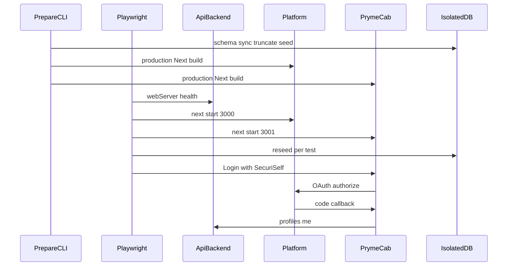

# Sprint 1 implementation

This document records what Sprint 1 implemented after the SecuriSelf Feature Prototype: **browser-level end-to-end automation** of the existing identity-disclosure path, plus automated accessibility checks on the same stack.

It is an implementation reference, not an evaluation report. Later sprints added Grants console UI and multilingual Contexts; those are out of scope here. Some of the files named below still exist and have been extended since Sprint 1. Where that matters, the Sprint 1 behaviour is described and the later change is noted.

---

## 1. Sprint objective

After the Feature Prototype, SecuriSelf already disclosed a selected Context through a three-application path:

1. PrymeCab (consuming application) starts “Login with SecuriSelf”.
2. The Platform shows the consent screen, where the identity owner picks a Context and approves or denies.
3. On approval, PrymeCab exchanges the authorization code and renders the filtered profile from the API.

Backend tests already exercised that filtering, token exchange, and related API rules against PostgreSQL. What they could not exercise was the **browser redirect chain itself**: that PrymeCab never receives the vault email after a real consent click, that Deny leaves no usable code, or that Activity reflects a grant that was just created or revoked in the browser.

Sprint 1 addressed that gap by adding Playwright as a third test layer. Chromium drives PrymeCab and the Platform together while the API serves the isolated test database. The underlying disclosure product was not rebuilt.

The same iteration also expanded backend Vitest coverage (ownership, lifecycle, audit). That work sits at the API layer already used by the Feature Prototype; it is complementary, not the Sprint’s main addition.

---

## 2. Implementation scope

### Playwright

Playwright is the **integrated-system** runner. A spec launches a real browser, follows cross-origin redirects, and then inspects both the rendered UI and the HTTP responses those pages trigger (PrymeCab’s profile route, Platform Activity).

Backend Vitest/Supertest remains the **API-boundary** runner. It proves the same privacy and token rules without a browser. Sprint 1 did not replace that layer; it added the missing browser layer above it.

The root commands introduced for this were:

- `pnpm test:e2e:prepare` — schema sync, truncate/seed of an isolated database, production builds of the two Next.js apps
- `pnpm test:e2e` — prepare, then Playwright excluding accessibility-tagged specs
- `pnpm test:a11y` — prepare, then only the `@a11y` specs

### Accessibility

Sprint 1 integrated `@axe-core/playwright` as a **separate tagged suite**, not as extra assertions mixed into every journey spec. Axe scans tagged WCAG 2A/2AA and 2.1 A/AA rules. The project gate fails the test on **critical** and **serious** impact findings; moderate and minor findings are attached as advisory output rather than hidden.

Axe does not prove that the consent radios or Approve/Deny buttons are keyboard operable, or that focused controls remain visible. Those checks are explicit Playwright steps in the same `@a11y` spec (focus, Enter on a radio, `aria-checked`). Automated accessibility here is a regression gate, not a substitute for assistive-technology user testing.

### Isolation

Browser tests truncate and reseed a dedicated PostgreSQL database. Preparation refuses to run unless the process is marked as E2E/test, `ALLOW_E2E_DB_RESET=true` is set, and the target URL is not the development database URL.

### Out of scope for Sprint 1

Sprint 1 did not add Grants console UI, UI-driven revoke, or language-specific Context fields. Those belong to later sprints.

---

## 3. How the implementation works

An automated browser scenario can exercise the integrated system because preparation, process startup, and per-test reset are wired together so every spec starts from the same owner, four Contexts, and PrymeCab client.



**Prepare.** `pnpm test:e2e:prepare` runs `tests/e2e/setup/run-prepare-cli.ts`. That syncs Prisma onto the isolated URL, truncates the identity tables, seeds one owner plus SOCIAL / LEGAL / PROFESSIONAL / PRIVATE Contexts and the PrymeCab client, then production-builds Platform and PrymeCab. Production `next start` is used instead of `next dev` because long suites were observed to corrupt Turbopack caches.

**Start the three apps.** Playwright’s `webServer` config starts the API on port 8080 (wait on `/health`), Platform on 3000, and PrymeCab on 3001. All three receive the isolated database URL and the seeded client credentials. CORS is limited to those two browser origins. Playwright waits until each URL responds before any spec runs.

**Serial execution.** Specs share one seeded user and client. The runner is therefore single-worker (`fullyParallel: false`, `workers: 1`) so one test cannot revoke a grant another test still needs.

**Per-test reseed.** The Playwright fixture in `tests/e2e/fixtures/test.ts` truncates and reseeds before every test (schema sync skipped). Journeys that create grants, tokens, or audit rows therefore cannot leak into the next spec.

**Drive the consent path.** Specs import `reachConsentScreen`: open PrymeCab, click Login with SecuriSelf, sign in as the seeded owner if the Platform asks, and wait until the consent copy and registered redirect URI are visible. From there a spec selects a Context by its internal name (a radio), then approves or denies. Approval waits until the browser is back on PrymeCab (`localhost:3001`). Helpers then assert the on-screen context label and fetch PrymeCab’s `/api/user` using the page’s cookie jar so the httpOnly access token is included.

**Revocation (Sprint 1).** There was no Grants page to click. After a successful SOCIAL consent, the spec reads the Platform session from `localStorage` (origin-scoped, so this happens while still on the Platform), calls the existing Grants API to revoke, then asserts PrymeCab’s profile route returns 401, the landing login button returns, and Activity shows “Access revoked”. Later work replaced that API-assisted browser check with a Grants UI flow; the Sprint 1 mechanism is the API plus browser verification described here.

---

## 4. What the automated implementation covers

This is implemented coverage, not execution results.

| Behaviour | Spec |
| --- | --- |
| SOCIAL Context selected, approved, filtered profile returned to PrymeCab, Activity shows a profile read | `tests/e2e/specs/social-disclosure.spec.ts` |
| LEGAL Context selected and approved; legal names and document id shown; vault email and social/professional fields absent | `tests/e2e/specs/legal-disclosure.spec.ts` |
| Deny after selecting a Context: no authorization code in the URL, PrymeCab profile 401, no ACCESS_GRANTED / PROFILE_READ audit | `tests/e2e/specs/consent-denial.spec.ts` |
| Vault still holds the owner email; SOCIAL and LEGAL third-party payloads never include it | `tests/e2e/specs/privacy-boundary.spec.ts` |
| Active grant revoked; access token unusable; Activity shows access revoked | `tests/e2e/specs/grant-revocation.spec.ts` (API-assisted in Sprint 1) |
| Axe on public pages, authenticated console routes then in the product, consent, and post-approval PrymeCab; keyboard focus on sign-in, Login with SecuriSelf, context radios, Deny, Approve | `tests/e2e/specs/accessibility.spec.ts` (`@a11y`) |

Social and legal specs also check the **consent preview JSON** and the **rendered PrymeCab UI** against the same forbidden-field lists used on the `/api/user` JSON. Privacy-boundary uses a **fresh browser context** for the LEGAL half so Platform `localStorage` from the SOCIAL grant is not reused.

Sprint 1 axe console paths were `/console`, `/console/vault`, `/console/contexts`, `/console/contexts/new`, `/console/clients`, and `/console/activity`. There was no `/console/grants` scan; that route did not exist in this sprint. The current accessibility spec later added a Grants-page and revoke-dialog scan.

---

## 5. Important implementation files and code

### `playwright.config.ts`

Owns the runner: Chromium only, serial workers, and the three `webServer` processes that make a cross-app click possible.

```ts
webServer: [
  {
    command: "pnpm --filter api-backend exec tsx src/index.ts",
    url: `${E2E_ORIGINS.api}/health`,
    env: apiServerEnv,
  },
  {
    // Production servers avoid Turbopack cache corruption under long suites.
    command: "pnpm --filter securiself-platform exec next start -p 3000",
    url: E2E_ORIGINS.platform,
    env: nextServerEnv,
  },
  {
    command: "pnpm --filter prymecab-simulator exec next start -p 3001",
    url: E2E_ORIGINS.prymecab,
    env: nextServerEnv,
  },
],
```

Playwright starts each command, polls the `url`, and only then runs specs ([webServer](https://playwright.dev/docs/test-webserver)). The Next apps get `NODE_ENV=production` so they match the `next start` builds; the API still receives `DATABASE_URL` pointing at the isolated database.

### `tests/e2e/setup/prepare-e2e.ts`

Guards truncation, then seeds the deterministic owner, Contexts, and PrymeCab client. `assertSafeToReset` is the safety mechanism: without it a mis-pointed URL would wipe a development database.

```ts
if (developmentUrl && normalizeUrl(developmentUrl) === normalizeUrl(targetUrl)) {
  throw new Error(
    "Refusing E2E DB reset: target URL matches development DATABASE_URL",
  );
}
```

`run-prepare-cli.ts` calls this with schema sync on, then `build-apps.ts`. `global-setup.ts` reseeds once more immediately before the suite (schema sync skipped) so a leftover grant from a killed run cannot survive into the first spec.

### `tests/e2e/fixtures/test.ts`

Every journey spec imports `test` from this file, not from `@playwright/test` directly. The auto fixture reseeds before each test:

```ts
export const test = base.extend({
  reseedDatabase: [
    async ({}, use) => {
      runPrepareE2E({ skipSchemaSync: true });
      await use(undefined);
    },
    { auto: true },
  ],
});
```

Cause: consent, denial, and revocation all write grants, tokens, or audit rows. Shared seed without per-test reset would make later specs order-dependent.

### `tests/e2e/helpers/oauth-flow.ts`

`reachConsentScreen` is the shared entry into the integrated path. It is written against **visible markers**, not a single URL wait, because production hydration can briefly open `/oauth/authorize` before bouncing to sign-in.

```ts
export async function reachConsentScreen(page: Page): Promise<void> {
  await openPrymeCabLanding(page);
  await startLoginWithSecuriSelf(page);
  await expect(signInMarker.or(consentMarker)).toBeVisible({ timeout: 30_000 });
  if (await signInMarker.isVisible()) {
    await signInAsE2EOwner(page);
  }
  await expect(consentMarker).toBeVisible({ timeout: 30_000 });
}
```

`selectContextByInternalName` uses `getByRole("radio")` so the same helper serves both journey specs and keyboard a11y. `approveConsent` waits for `localhost:3001`; `denyConsent` asserts the Platform “Access denied” state instead of a PrymeCab profile. The current file also contains `openGrants`; that helper is later Grants-UI work, not Sprint 1.

### `tests/e2e/helpers/privacy-assertions.ts`

Defines the allow/forbid field sets the browser specs share with the product’s category rules (SOCIAL may include display name, username, pronouns, avatar; it must not include email, legal names, document id, job title, and so on). `assertProfileObject` checks PrymeCab JSON; `assertUiHasNoForbiddenText` checks the rendered `<main>` so a field cannot leak in the UI while being omitted from JSON.

### `tests/e2e/helpers/api.ts`

Gives the browser tests a second channel into the running apps without leaving Playwright. `fetchPrymeCabProfile` uses `page.request` so PrymeCab’s httpOnly cookie is sent. `getPlatformSessionToken`, `listGrants`, and `revokeGrant` are what made Sprint 1 revocation possible without a Grants screen: read the Platform JWT from `localStorage`, revoke over the API, then continue asserting in the browser.

### `tests/e2e/helpers/accessibility.ts`

Wraps Deque’s Playwright builder. Tags restrict the rule set; impact decides whether the test fails.

```ts
const AXE_TAGS = ["wcag2a", "wcag2aa", "wcag21a", "wcag21aa"] as const;

let builder = new AxeBuilder({ page }).withTags([...AXE_TAGS]);
const results = await builder.analyze();
const blocking = results.violations.filter(
  (v) => v.impact === "critical" || v.impact === "serious",
);
expect(blocking, /* … */).toEqual([]);
```

[`AxeBuilder.withTags`](https://github.com/dequelabs/axe-core-npm/blob/develop/packages/playwright/README.md) is the official way to limit axe-core to those WCAG tags. `expectFocusVisibleOn` is the complementary keyboard helper: focus a named role and assert `toBeFocused()`.

### `tests/e2e/specs/social-disclosure.spec.ts`

Representative happy path. After `reachConsentScreen`, it asserts PrymeCab `/api/user` is 401 **before** approve, checks the consent preview does not contain vault or legal values, approves, asserts the SOCIAL profile object and UI, then opens Activity for a “Profile read” row.

### `tests/e2e/specs/accessibility.spec.ts`

Tagged `@a11y` so `pnpm test:e2e` can exclude it via `--grep-invert` while `pnpm test:a11y` selects it. Sprint 1 covered public landings and sign-in/sign-up, the console routes listed in section 4, the consent screen (radio + Enter, Deny/Approve focus), and the PrymeCab profile after approve.

### Root `package.json` scripts

Sprint 1 split journey tests from accessibility by tag:

```json
"test:e2e": "pnpm test:e2e:prepare && playwright test --grep-invert \"@a11y|@evidence\"",
"test:a11y": "pnpm test:e2e:prepare && playwright test --grep \"@a11y\""
```

The current `test:e2e` grep list also excludes later-sprint tags; the Sprint 1 split was `@a11y` versus the journey specs. An optional `@evidence` screenshot spec existed in the same tree for write-up figures; it is not journey coverage.

---

## 6. Technical decisions worth understanding

**Three `webServer` entries.** Disclosure is cross-origin by design (PrymeCab `:3001` → Platform `:3000` → API `:8080`). A single-app Playwright config could not follow that redirect or prove that the browser never talks to the API origin directly (`startLoginWithSecuriSelf` asserts the URL contains `:3000` and not `:8080`).

**Isolated database and overlap refusal.** Preparation issues `TRUNCATE … CASCADE`. The URL check against development `DATABASE_URL` exists because the same Prisma models are used in local development; a copied env file must not point truncation at that data.

**Per-test reseed.** Grants and access tokens are mutable product state. Serial workers remove parallel races; reseed removes sequential coupling.

**`next start` rather than `next dev`.** Stated in the Playwright config: production servers avoid Turbopack cache corruption under long suites. `build-apps.ts` therefore runs Platform and PrymeCab production builds during prepare, with the seeded `NEXT_PUBLIC_*` client values baked in.

**Single Chromium project.** The config defines one project (`chromium` / Desktop Chrome). There is no Firefox or WebKit project in this implementation.

**API-assisted revocation.** Sprint 1 had Grants API endpoints and Activity, but no Grants console UI. The revocation spec therefore mutated the grant through the real API (authenticated with the Platform session already established in the browser) and verified the **effect** in PrymeCab and Activity. That split is a consequence of product scope at the time, not a substitute for later UI automation.

**Axe tags plus an impact gate.** Tagging keeps the scan on WCAG 2 / 2.1 A and AA. Failing only critical and serious impact matches Deque’s impact ranking while still recording moderate/minor findings instead of disabling those rules. Keyboard and semantic checks remain separate because axe does not operate the consent radios or prove focus visibility.

**Semantic locators.** Journey and a11y helpers locate Email/Password labels, radios, and Approve/Deny by role and accessible name. Small Prototype UI labelling needed to be stable enough for that; the disclosure behaviour itself was already present.
