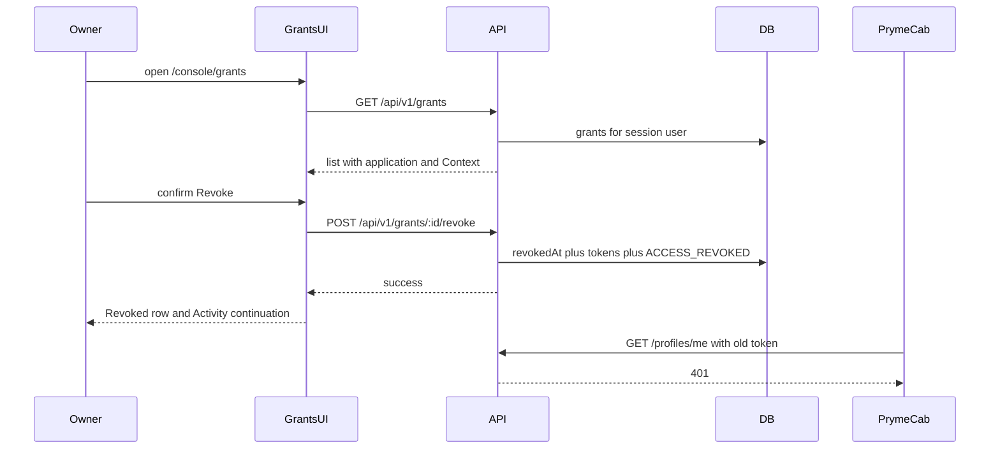

# Sprint 2 final summary

SecuriSelf — user-facing Grants management and revocation  
Factual synthesis of what was implemented, how it works, how it was validated technically and with users, what was learned, what was changed, and what the Sprint established.

Sources: [`SPRINT2-IMPLEMENTATION.md`](./SPRINT2-IMPLEMENTATION.md), [`SPRINT2-VALIDATION.md`](./SPRINT2-VALIDATION.md), [`SPRINT2-EXTERNAL-EVALUATION.md`](./SPRINT2-EXTERNAL-EVALUATION.md), [`SPRINT2-POST-EVALUATION-IMPLEMENTATION.md`](./SPRINT2-POST-EVALUATION-IMPLEMENTATION.md), [`SPRINT2-POST-CHANGE-EXTERNAL-EVALUATION-REVISED.md`](./SPRINT2-POST-CHANGE-EXTERNAL-EVALUATION-REVISED.md), [`docs/sprint2/images/`](./images/), and the current Grants, Activity and PrymeCab code. Sprint 1’s next-iteration note and Sprint 3’s multilingual objective are used only to bound this Sprint.

This is a consolidated briefing for a later academic write-up. It is not the academic Sprint report.

Product evolution in this Sprint, in the order it happened:

1. **Initial implementation** — Grants console page, inspect, confirm, revoke.
2. **Initial external evaluation** — ten participants on that first interface.
3. **Evaluation findings** — navigation and semantic issues, not a broken revoke operation.
4. **Feedback-driven revision** — continuation, Context naming, PrymeCab wording, timestamp label.
5. **Focused post-change evaluation** — three participants on the revised areas.
6. **Final Sprint 2 state** — the revised interface, technically validated as documented below.

The technical validation record describes the **revised** interface. The ten-participant evaluation describes the **initial** interface.

---

## 1. Sprint boundary

### What already existed

Before Sprint 2, SecuriSelf already supported contextual third-party authorisation. An identity owner could approve PrymeCab’s request for one **Context** (a purpose-bound identity projection such as Social). Consent created a **Grant**: the unique stored permission binding one owner, one registered application, and one Context. The API already exposed `GET /api/v1/grants` and `POST /api/v1/grants/:id/revoke`. Revoking a Grant set `revokedAt`, invalidated matching access tokens, wrote `ACCESS_REVOKED`, and caused later `GET /api/v1/profiles/me` with the old token to return 401.

Sprint 1 had shown that this enforcement could be checked in a browser, but revocation in that Sprint was **API-assisted**: the test called the Grants endpoint with the Platform session; the owner had no Grants screen.

Also already present, and used rather than introduced here: session authentication on Grants routes; Activity listing of audit events; PrymeCab’s profile fetch through `/api/user`; re-authorisation that clears `revokedAt` on the **same** Grant row.

### What remained missing

The system could represent and revoke permissions, but the identity owner did not have a complete interface for inspecting those permissions and withdrawing them. Authorisation had a user-facing consent path; withdrawal did not.

### What Sprint 2 introduced

Provide a user-facing **Grants management journey** through which an identity owner could inspect an application’s permission to a Context, revoke it deliberately, observe the resulting state, verify the Activity record, and confirm the consequence in PrymeCab.

The Sprint did not rebuild OAuth-like consent, Context CRUD, token issuance, or Activity storage. It added the owner-facing control surface and, after evaluation, the presentation needed to complete the verification journey.

---

## 2. Why the feature was necessary

A user who can grant third-party access, but cannot later see that access, identify which Context it uses, withdraw it, and check that withdrawal had a real effect, has an incomplete control lifecycle.

The concrete limitation was: after consent, the Grant existed in the database and could be revoked by API, yet the console had no place to list application–Context permissions or to revoke them with confirmation. The owner could not complete inspect → withdraw → verify without leaving the product’s intended user path.

Sprint 2 therefore treated revocation as a **user-control** problem as well as a security property. The later academic report may cite an authoritative delegated-authorisation specification for the general principle that issued access should be withdrawable; the SecuriSelf-specific claim that *this* Grants UI withdraws *this* PrymeCab permission must rest on project evidence, not on that citation.

---

## 3. What was implemented

### User-visible feature (initial, then retained)

- Console route `/console/grants`, behind the same signed-in console guard as other owner screens, with a sidebar **Grants** item.
- List of the owner’s Grants, newest `createdAt` first: application `name` and `clientId`; Context primary label and category; **Active** or **Revoked** from `revokedAt`; first-authorised time; revoked time or an em dash.
- **Revoke** only on active Grants; accessible name `Revoke {application} access to {context}`.
- Confirmation dialog naming the application and Context, stating that confirming invalidates access and tokens for that pair without deleting the Context, application, or activity history. **Cancel** does not call the API.
- After success: the Grant remains visible as **Revoked**, without a Revoke control.

Desktop uses a table; narrower viewports use cards. The list API also returns `scope` and `expiresAt`; the Grants UI does not display them.

### Existing backend mechanisms used by the feature

- Unique `(userId, applicationId, contextId)` Grant.
- Consent upsert (create or reactivate by clearing `revokedAt`).
- `authUser` on Grants routes.
- `revokeGrant`: set `Grant.revokedAt`, set `revokedAt` on matching unrevoked access tokens, insert one `ACCESS_REVOKED`.
- Token validation rejecting a token with `revokedAt` set.
- Activity already able to list `ACCESS_REVOKED`.

### Feedback-driven additions (revised / final state)

These are presentation and continuity changes on top of the same permission model (section 8):

- Post-revoke continuation on Grants: **View Activity** plus guidance to check PrymeCab; no automatic redirect.
- Shared primary Context `displayName` on Grants and Activity; distinct `internalName` secondary on Activity only.
- PrymeCab `access_lost` copy when the previous token is rejected.
- `createdAt` labelled **First authorised**, matching the data model.

**Claim:** Sprint 2 added an owner-facing Grants journey; it did not invent Grant persistence or token invalidation.  
**Implementation:** Platform Grants module versus pre-existing `grants.service.ts` and `requireBearerToken`.  
**Validation:** API tests of revoke pre-date the UI; E2E now drives revoke through `/console/grants`.  
**Interpretation:** the Sprint’s distinctive work is inspectability and user-initiated revocation, using enforcement that already existed.

---

## 4. Technical flow

Two credentials are involved. The Platform sends the owner’s **session JWT** so Grants are restricted to that user. PrymeCab sends the **application access token** issued at token exchange; the API accepts it only while that token row’s `revokedAt` is null.



| Step | Trigger | Persistent change | What does not change | Observable result |
| --- | --- | --- | --- | --- |
| Open Grants | Sidebar or direct visit | None | — | List for the signed-in owner |
| Identify permission | Render of list item | None | — | Application, Context, Active/Revoked |
| Confirm revoke | Dialog **Revoke access** | None yet | Cancel leaves Grant active | Dialog names the pair |
| POST succeeds | `grant.id` + owner session | `Grant.revokedAt`; matching tokens `revokedAt`; one `ACCESS_REVOKED` | Grant row, Context, application, prior audit rows kept | HTTP success |
| UI refresh | Mutation success | None further | No automatic navigation | **Revoked**, no Revoke, continuation |
| Activity | **View Activity** link | None | — | **Access revoked** for that app and Context |
| PrymeCab | Landing / profile retry | None | Cookie may remain | Access-lost; profile 401 `access_rejected` |

Repeated revoke of the same Grant is handled on the API: the same `revokedAt` is returned, no second `ACCESS_REVOKED`, already-revoked tokens are not updated. The UI simply omits **Revoke** after refetch. Re-authorisation is consent, not the Grants page: the same Grant id is reactivated.

**Claim:** Revocation affects actual third-party access rather than only changing a badge.  
**Implementation:** matching active access tokens receive `revokedAt`; `requireBearerToken` rejects them.  
**Validation:** API profile 401 after revoke; E2E PrymeCab 401 and access-lost landing.  
**Interpretation:** in the tested PrymeCab Social scenario, the visible **Revoked** state corresponds to enforced loss of the previously issued access.

---

## 5. Essential implementation mechanisms

Four excerpts are enough to understand the Sprint: the user trigger, the persistent revoke, the post-evaluation continuation, and the PrymeCab interpretation of rejection.

### 5.1 Confirmation posts the Grant id

Source: `apps/securiself-platform/src/features/grants/components/revoke-grant-dialog.tsx`

```ts
const handleRevoke = () => {
  if (revoke.isPending) return;
  revoke.mutate(grant.id, {
    onSuccess: () => {
      toast.success("Grant revoked");
      onRevoked?.(grant);
      setOpen(false);
    },
    onError: (error) => {
      toast.error(
        error instanceof ApiError ? error.message : "Could not revoke grant",
      );
    },
  });
};
```

**Why it exists.** Revoke must be deliberate and tied to one list row.

**Input.** `grant.id` from the active row; pending flag disables a second click.

**Transition.** `useRevokeGrant` POSTs `/api/v1/grants/{id}/revoke` with the session token. Cancel never enters this function.

**Result.** Success: toast, parent notified, dialog closes. Failure: dialog stays open, `onRevoked` is not called, error toast.

**Sprint relevance.** This is the owner-initiated action that Sprint 2 added on top of the existing API.

**Protection.** Pending guard; failure does not show a revoked continuation.

### 5.2 Persistent revoke, token invalidation, audit

Source: `apps/api-backend/src/modules/grants/grants.service.ts`

Before the transaction the service loads the Grant by id, returns 404 if missing, and 403 if `grant.userId` is not the session user. An already-revoked row is returned unchanged.

```ts
await tx.grant.updateMany({
  where: { id: grant.id, userId, revokedAt: null },
  data: { revokedAt: now },
});
// if count === 0, return current row without a second audit

await tx.accessToken.updateMany({
  where: {
    userId: grant.userId,
    applicationId: grant.applicationId,
    contextId: grant.contextId,
    revokedAt: null,
  },
  data: { revokedAt: now },
});

await tx.auditLog.create({
  data: {
    userId: grant.userId,
    applicationId: grant.applicationId,
    contextId: grant.contextId,
    action: "ACCESS_REVOKED",
    ipAddress: meta.ipAddress ?? null,
    userAgent: meta.userAgent ?? null,
  },
});
```

**Why it exists.** The UI must drive a real permission change, not only a local badge.

**Input.** Owner `userId`, Grant `id`, request IP and user-agent.

**Transition.** First winner sets `Grant.revokedAt`, then matching unrevoked tokens, then one `ACCESS_REVOKED`. Concurrent loser (`count === 0`) does not duplicate audit or token updates.

**Result.** Same Grant id, now revoked; tokens for other applications or Contexts are not selected by this `where`.

**Sprint relevance.** This is the system-level consequence the Grants journey is for.

**Protection.** Owner check; missing Grant 404; idempotent repeat; tokens scoped to the Grant’s triple.

### 5.3 Stay on Grants and offer the next action

Source: `apps/securiself-platform/src/features/grants/components/grants-page.tsx`  
(introduced in the feedback-driven revision)

```ts
const handleRevoked = (grant: Grant) => {
  setContinuation({
    applicationName: grant.application.name,
    contextLabel: grantContextLabel(grant.context),
  });
};
```

**Why it exists.** The ten-participant evaluation showed that revoke was understood, but two people needed a hint to continue to Activity or back to PrymeCab.

**Input.** The Grant object already on screen (not the unused API body).

**Transition.** Local continuation state; `RevokeContinuation` renders **View Activity** (`/console/activity`) and copy to check PrymeCab. Query invalidation separately refetches the list.

**Result.** Revoked row and next-step guidance remain on Grants. No redirect.

**Sprint relevance.** Completes the inspect → withdraw → **verify** path that the Sprint objective required.

**Protection.** Continuation is set only from dialog `onSuccess`, not from Cancel or error.

### 5.4 Rejected access is not a generic error

Source: `apps/prymecab-simulator/lib/access-state.ts`  
(revised wording after evaluation)

```ts
if (input.reason === "access_rejected") {
  return { kind: "access_lost" };
}
```

Generic network or unspecified failures use a separate `error` state whose copy does not mention revocation.

**Why it exists.** One participant initially read the old rejection as a possible technical failure rather than the result of revoke.

**Input.** PrymeCab `/api/user` outcome after SecuriSelf profile 401.

**Transition.** Only `access_rejected` becomes `access_lost`. Token validation on the API was not changed.

**Result.** Landing copy: previous SecuriSelf access is no longer available; re-authorise to restore; no stale Social profile.

**Sprint relevance.** Makes the third-party consequence of Grants revoke interpretable.

**Protection.** Distinguishes lost authorisation from temporary service problems.

A related presentation rule, also from evaluation: Grants and Activity share `grantContextLabel` (`displayName`, else `internalName`). Activity may show a distinct internal name as secondary text; Grants does not. That is labelling only; Context ids and Grant bindings are unchanged.

Cache refresh after success (`useRevokeGrant` invalidates Grants and Activity query keys) is how the row becomes **Revoked** and how Activity can load the new event. It is supporting mechanism, not a fifth excerpt.

---

## 6. Technical validation

Automated tests cannot replace human evaluation, but they answer different questions. The recorded execution (18 August 2026) is of the **revised** Grants journey.

Layers are complementary: a passing component test does not prove PrymeCab lost access; a passing E2E journey does not prove idempotent repeat-revoke or cross-user 403.

### Frontend / component tests

**Question.** Does the Grants interface present and change state correctly?

**Result.** 18/18 passed (`pnpm --filter securiself-platform test src/features/grants`).

They cover Active versus Revoked, Revoke only when active, Cancel without mutate, confirm with `grant.id`, failure without continuation, loading/empty/error, continuation copy and Tab to **View Activity**, list envelope unwrap, POST path, and query invalidation.

### Backend / API tests

**Question.** Does revoke persist and enforce independently of the browser?

**Result.** 6/6 Sprint 2-relevant cases passed when run in isolation (a concurrent first attempt on the shared test database produced 401s and is not counted).

They cover: `revokedAt` and one `ACCESS_REVOKED` on first revoke; second revoke keeps timestamp and audit count; profile 401; other user 403 and Grant still active; list includes application and Context fields without client secret; re-authorisation clears `revokedAt` on the same id.

No test creates two Grants and revokes one; isolation of unrelated permissions is implemented in the `where` clause but not asserted.

### PrymeCab mapping

**Question.** Is rejected access labelled as lost authorisation rather than a generic error?

**Result.** 2/2 relevant cases passed (`access_rejected` → `access_lost`; generic failure copy does not mention revocation).

### Browser end-to-end

**Question.** Do Platform, API and PrymeCab cooperate through the real UI path?

**Result.** 1/1 passed (Chromium): Social consent → active PrymeCab Grant → confirm revoke on Grants → continuation and **Revoked** → Activity **Access revoked** → PrymeCab access-lost → profile 401 `access_rejected`.

This is the evidence that isolated layers cannot supply: the owner reached the system consequence *by using the Grants confirmation UI*.

### Accessibility-specific checks

**Question.** Are the Grants interactions covered by existing keyboard and axe checks?

Component tests passed for accessible revoke names and Tab to **View Activity**. The dedicated Playwright test “Grants page and revoke dialog pass the a11y gate” **failed**: axe reported 1 serious `color-contrast` violation on the open dialog (4 nodes). The active Grants page scan in the same test had 0 critical and 0 serious. Keyboard focus and Enter opened the dialog; Escape dismiss was not reached because the test stopped at axe.

This is not WCAG conformance, not assistive-technology testing, and not a passing accessibility gate for the dialog.

---

## 7. Why human evaluation was also required

Automated tests showed that the programmed flow could list a Grant, require confirmation, persist revoke, record `ACCESS_REVOKED`, and reject the old token. They could not determine whether a person understood the permission, found Revoke, knew what confirmation meant, or knew to open Activity and then PrymeCab.

The Sprint objective included *verify*. That is a comprehension and navigation question as well as a state-transition question.

---

## 8. Initial external evaluation

Ten participants (P01–P10), 2–4 August 2026, synthetic demonstration data, one prepared active PrymeCab Grant. Eight had no prior SecuriSelf familiarity; two had. Web-application familiarity: high 4, moderate 4, low 2. Six local sessions, four peer-review sessions. Assistance only when unable to continue. Technical incidents: 0.

**Task.** Find PrymeCab’s active permission, identify the Context, revoke it, locate the Activity record, then check whether PrymeCab still had access.

**Post-task statements** (Disagree … Agree):

1. Grant clarity — application, Context, and active/revoked were clear.
2. Revocation comprehension — before confirming, understood that PrymeCab would lose access.
3. Journey independence — could complete revocation and verify Activity and PrymeCab without assistance.

This round used the **initial** interface (before continuation, shared Context labels, access-lost copy, and **First authorised**).

### Observational outcomes

| Measure | Result |
| --- | ---: |
| Correct Grant selected | 10/10 |
| Core task without procedural assistance | 8/10 |
| Core task with procedural assistance | 2/10 |
| `ACCESS_REVOKED` located | 10/10 |
| PrymeCab access loss interpreted correctly | 10/10 |
| Wrong Grant revoked | 0/10 |
| Believed PrymeCab retained access | 0/10 |
| Technical incidents | 0/10 |

Assisted sessions were navigation: P09 needed a hint to find Activity after revoke; P10 needed a hint to return to PrymeCab. Neither needed help selecting the Grant or interpreting the final access-loss once they reached it.

### Likert responses

| Statement | Agree | Partially agree | Other |
| --- | ---: | ---: | ---: |
| Q1 — Grant clarity | 7/10 | 3/10 | 0 |
| Q2 — Revocation comprehension | 8/10 | 2/10 | 0 |
| Q3 — Journey independence | 3/10 | 7/10 | 0 |

Eight people completed the task unassisted, but only three fully agreed they could complete the verification journey independently. Partial agreement reflected hesitation, labelling, confirmation wording, or the PrymeCab message — friction that did not always cause task failure.

**Claim:** The revocation *concept* was understood; the *verification journey* was the weak point.  
**Implementation:** initial Grants UI with confirm and backend revoke, without post-revoke continuation.  
**Validation:** 10/10 correct Grant, 10/10 Activity, 10/10 PrymeCab interpretation; 8/10 unassisted; Q3 only 3/10 Agree.  
**Interpretation:** redesigning the permission model was not justified; continuity and wording were.

---

## 9. Findings that drove design

Prioritised by **impact on the privacy-control journey** as well as frequency. Not every comment became a feature.

| Finding | Observed | Why it mattered | Frequency / impact | Decision |
| --- | --- | --- | --- | --- |
| Navigation continuity | P06 expected management in Activity; P09, P10 needed hints; P04 asked for a path from the revoked Grant to Activity | Verify requires Grants → Activity → PrymeCab | High: two assisted completions | Implement continuation, no auto-redirect |
| Timestamp semantics | P01, P07: re-authorised Grant kept the older date | Could be read as latest approval; value is `createdAt` | Medium: 2, no wrong revoke | Label **First authorised** |
| Context naming | P02: Grants and Activity showed different names | Weakened confidence that Activity was the same permission | Medium: 1, recovered via app name and time | Shared `displayName` |
| PrymeCab wording | P08: rejection sounded like a possible outage | Final consequence not explained in plain language | Medium: 1, then interpreted correctly | Dedicated access-lost state |
| Status vs date hierarchy | P03: date and status competed visually | Scanning friction | Low: recovered, correct Grant | Defer |
| Confirmation specificity | P05 wanted application and Context nearer the final button | Possible ambiguity with many similar Grants | Low: no wrong Grant in 10/10 | Defer |

Deferred items remain valid observations. They did not produce incorrect actions or assistance in this sample, so they did not widen the revision.

---

## 10. Feedback-driven revision

The permission model, revoke API, token invalidation, `ACCESS_REVOKED`, and Context bindings were **not** changed. Four presentation/continuity changes were.

### Explicit continuation after revocation

Revoked Grant stays visible; inline alert names application and Context; **View Activity**; guidance to check PrymeCab; no forced redirect. Addresses navigation continuity: the owner can see **Revoked** and still know the next verification step.

### Context naming consistency

Primary label is `displayName` (else `internalName`) on Grants and Activity. Distinct internal name is secondary on Activity. Unresolvable historical Contexts show `Context unavailable` rather than failing the page. Addresses mismatched names for the same permission. Identity of the Context is unchanged.

### Plain-language PrymeCab access-loss

`access_rejected` maps to `access_lost`: previous access no longer available; re-authorise to restore; stale profile not shown. Generic errors stay generic. Addresses confusion between revoke and a temporary failure. API token policy unchanged.

### Accurate timestamp wording

`Grant.createdAt` is first creation. Re-authorisation reuses the row and clears `revokedAt`; it does not rewrite `createdAt`. Latest `ACCESS_GRANTED` lives in Activity, not as a Grant list field. The UI therefore says **First authorised**, not “Authorised” or “Last authorised”. Addresses date-after-re-approval misreading. No schema change.

---

## 11. Final interface evidence

Images under [`docs/sprint2/images/`](./images/) are of the **revised** E2E implementation (18 August 2026). They are the principal visual record for the later report.

| File | Visible | Claim it supports | What a reviewer should notice |
| --- | --- | --- | --- |
| `grants-active-permission.png` | PrymeCab, client id, AngelaTech, Social, **Active**, **Revoke**, **First authorised** | Owner can inspect the correct application–Context permission | Status Active and Revoke present before action |
| `grants-revoke-confirmation.png` | Dialog names PrymeCab and AngelaTech; Cancel and Revoke access | Revoke is confirmed, not a single click | Copy states tokens stop and nothing is deleted |
| `grants-revoked-state.png` | **Revoked** row, no Revoke, continuation, **View Activity**, PrymeCab guidance | Post-evaluation continuity plus persisted (not deleted) Grant | Same row, new status, next step on the same page |
| `activity-access-revoked.png` | **Access revoked** for PrymeCab / AngelaTech, internal name secondary | Audit of the same Context as Grants | Newest event is revoke; primary name matches Grants |
| `prymecab-access-lost.png` | Previous access no longer available; Login with SecuriSelf; no Social profile | Third-party consequence of Grants revoke | Lost-access copy, not a generic outage and not a still-valid profile |

`e2e-grant-revocation-result.png` documents the Playwright pass (1/1, Chromium, 18.7s). It is useful in the technical annex, not as a product figure in a short academic report.

Most valuable for the report: **active Grant**, **confirmation**, **revoked + continuation**, **PrymeCab access-lost**. The Activity figure is the audit half of “verify” if space allows.

---

## 12. Focused post-change external evaluation

Three participants (P01–P03), revised interface, same style of revoke-and-verify task. **Not** a second full usability study. Purpose: whether the **specific problems targeted by the revision** remained.

Questions:

1. After revoke, was the next step through Activity and PrymeCab clear?
2. Did Grants and Activity refer to the same Context?
3. Was PrymeCab’s message clear that previous permission was gone and re-authorisation is required?

| Measure | Result |
| --- | ---: |
| Post-revocation continuation understood | 3/3 |
| Same Context matched across Grants and Activity | 3/3 |
| PrymeCab access-loss interpreted correctly | 3/3 |
| Blocking usability difficulty reported | 0/3 |

The earlier navigation, naming, and wording issues were not reproduced in this follow-up. No further Sprint 2 interface change was made. Deferred F05/F06 items stayed deferred.

This is focused human evidence for the revised areas. It is not a statistically generalisable usability result and does not by itself prove population-level improvement.

---

## 13. What Sprint 2 established

Taken together:

- a user-facing Grants list and confirmed revoke;
- backend enforcement (`revokedAt`, token invalidation, `ACCESS_REVOKED`);
- Activity visibility of **Access revoked**;
- observable PrymeCab access loss;
- ten-person evaluation of the initial UI;
- evidence-driven continuity and wording changes;
- three-person confirmation that those targeted issues were understood.

**Bounded conclusion.** In the tested Sprint 2 scenarios, the identity owner could manage an existing third-party Context permission through a visible interface, and revocation propagated beyond the UI to the stored Grant, issued access tokens, the audit log, and PrymeCab.

That is stronger than “the Grants page worked.” It is weaker than universal usability, production security certification, or WCAG conformance.

**Claim:** The Sprint objective is functionally complete.  
**Implementation:** Grants journey plus the four presentation revisions; no unimplemented control required by the objective.  
**Validation:** 18/18 frontend, 6/6 relevant API, 1/1 E2E; 10/10 core comprehension measures; 3/3 on revised questions.  
**Interpretation:** remaining issues are validation boundaries and one failed dialog contrast check, not a missing Grants capability.

---

## 14. Validation boundaries and genuine gaps

### Functional gaps

None required for the stated Sprint objective. Unrelated-permission isolation is implemented but not covered by an automated two-Grant test. Re-authorisation is consent, not a Grants-page action, by design. E2E Cancel is covered at component level, not in the browser journey.

### Validation boundaries

- Human samples: n=10 (initial), n=3 (follow-up); one prepared PrymeCab Grant; not a population study.
- Browser E2E: Chromium only.
- Automated accessibility: not WCAG; dialog axe **failed** colour contrast; Escape dismiss not completed in that run.
- Prototype OAuth-like stack: not a certified OAuth/OIDC implementation.
- Defined scenarios, not production-scale concurrent owners.
- API Grant tests share one database and must not overlap.

These limit how far the evidence can be generalised. They are not a future-work list.

---

## 15. Next iteration

Sprint 2 established that the owner can control **whether** an authorised application retains access to a Context.

The next iteration (Sprint 3) investigates whether the **representation** of that already-authorised Context can adapt to language: English and Spanish variants on localisable fields, and language-aware profile disclosure, without changing which fields the Grant allows.

That work is not part of Sprint 2.

---

## 16. Claims that would benefit from an external citation

The later report should cite SecuriSelf evidence for SecuriSelf results. A small number of *principles* are not demonstrated by this prototype and may need an authoritative source:

| Claim in a later report | Suggested source type |
| --- | --- |
| Issued delegated access should be withdrawable (revocation as an expected property of authorisation, not a SecuriSelf invention) | Standards/specification for delegated authorisation or token revocation (for example OAuth-related RFC material), used only for the general principle |
| Automated axe checks do not establish WCAG conformance | WCAG W3C recommendation and/or axe-core documentation stating coverage limits |
| If the report argues that a successful action should expose a next verification step (justifying continuation) | HCI / usability source on post-action feedback or user control, used only if that argument is made; the n=10 finding itself needs no external citation |

Do not cite literature for “10/10 selected the correct Grant” or “PrymeCab returned 401.”

---

## Recommended Report Evidence

A 2,000-word report cannot carry every test file. Prefer:

| Item | Why it earns space |
| --- | --- |
| One technical flow diagram (Grants → confirm → persist tokens + `ACCESS_REVOKED` → Activity → PrymeCab 401) | Shows cause and effect without a code tour |
| Backend revoke transaction excerpt | Proves the UI is not cosmetic |
| Dialog `handleRevoke` excerpt | Proves confirmation is required |
| Continuation `handleRevoked` **or** PrymeCab `access_lost` mapping | Shows the evaluation actually changed the product |
| `grants-active-permission.png` | Inspectability |
| `grants-revoke-confirmation.png` | Deliberate revoke |
| `grants-revoked-state.png` | Grant not deleted + post-evaluation next step |
| `prymecab-access-lost.png` | Third-party consequence |
| Initial evaluation outcomes table (10/10, 8/10, 0 wrong Grant) | Human evidence that the concept was understood |
| Finding → change → 3/3 follow-up table | Shows restrained, evidence-driven revision |

Optional if words remain: Activity screenshot; `grantContextLabel` as a one-liner rather than a figure.

Omit: Playwright HTML report, terminal dumps, all 18 frontend rows, all ten observation sheets, duplicate revoke screenshots.

---

## Material that must not enter the final academic narrative

- Commit hashes, tags, HEAD, freeze / frozen package, Candidate labels
- Evidence-pack or evidence-freeze mechanics
- Repository administration and file inventories
- Screenshots of routine test-runner output as product evidence
- Duplicated pass/fail lists already summarised in tables
- Implementation chronology that does not change the argument (the useful sequence is initial UI → evaluation → revision → follow-up, not day-by-day development)
- Promotional claims (fully secure, completely accessible, production-ready)
- Sprint 3 multilingual behaviour presented as Sprint 2 work
