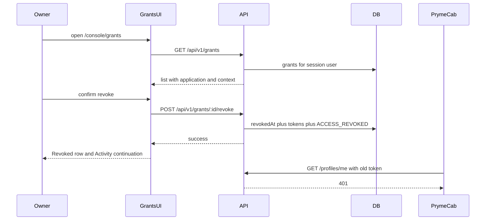

# Grants UI implementation

This document records the **Grants console UI**: the Platform screen at `/console/grants` that lists an identity owner’s application–Context permissions and lets the owner revoke them.

It is an implementation reference for the behaviour present in the code. It is not an evaluation report.

---

## 1. Purpose of the Grants UI

A **Grant** is the stored permission that binds one identity owner, one registered third-party **application** (client), and one **Context** (a purpose-bound identity projection such as Social or Professional). The database enforces uniqueness on that triple. The default scope is `identity_context`. The Grant is **active** while `revokedAt` is null and **revoked** once that timestamp is set.

Consent already created that row. When the owner approves an authorization request, the OAuth consent handler upserts the Grant and writes an `ACCESS_GRANTED` audit event. Re-approving the same application and Context clears `revokedAt` on the existing row rather than inserting a duplicate. The API already exposed `GET /api/v1/grants` and `POST /api/v1/grants/:id/revoke`.

The Grants page is the console surface for that inspection and control. The owner identifies a permission and, if it is active, revokes it so issued **access tokens** for that application–Context pair stop working.

---

## 2. Scope of the implementation

The Grants UI covers the following, all present in the current code:

- Retrieve the signed-in owner’s Grants (`GET /api/v1/grants`), newest `createdAt` first.
- Display the third-party application (`name` and `clientId`) on each row.
- Identify the authorised Context by its primary label (non-empty `displayName`, otherwise `internalName`) and a category badge.
- Present **Active** or **Revoked** from `revokedAt`.
- Show **First authorised** (`createdAt`) and a revoked timestamp (`revokedAt`, or an em dash when null).
- Offer **Revoke** only for active Grants; require confirmation before the request is sent.
- After a successful revoke: toast, close the dialog, keep the Grant visible as Revoked (no Revoke control), and show a continuation alert with **View Activity** plus guidance to check PrymeCab. The page does not redirect automatically.
- Refresh the Grants list and the Activity query cache after success.
- Call the existing Grants API; the API persists `revokedAt`, revokes matching active access tokens, and writes one `ACCESS_REVOKED` audit row.

The list API also returns `scope` and `expiresAt`. The Grants UI does not display them. The Grants table does not show the Context `internalName` as secondary text; Activity does, using helpers defined next to the Grants labels.

### Implementation boundary

**This feature** is the Platform Grants module: the `/console/grants` route, the sidebar **Grants** item, the list/dialog/continuation UI, the client API wrappers, and the query-cache invalidation that follows a revoke.

**Already present elsewhere**, and used by this feature rather than introduced by it:

- Grant persistence and the unique `(userId, applicationId, contextId)` constraint.
- Consent creating or reactivating a Grant (`grant.upsert` with `update: { revokedAt: null }`).
- Session authentication (`authUser`) on the Grants routes.
- Activity listing of audit events, including `ACCESS_REVOKED`.
- Rejection of a revoked application access token on `/api/v1/profiles/me`.
- PrymeCab’s `access_lost` state when its `/api/user` route sees a failed profile read.

---

## 3. User-visible flow

The owner must be signed in. `/console/grants` sits behind the console `AuthGuard`.

1. **Open Grants.** The sidebar **Grants** item (or a direct visit) loads `/console/grants`. `GrantsPage` calls `useGrants`, which requests `GET /api/v1/grants` with the owner’s session token. While the request is in flight the page shows a loading placeholder; a failed request shows an error with retry; an empty list shows “No grants yet” and a link to Clients.

2. **Identify the permission.** Each Grant shows the application name, `clientId`, Context primary label, category, status (**Active** or **Revoked**), **First authorised**, and (when revoked, or always in the desktop table) the revoked time. Desktop uses a table; narrower viewports use cards.

3. **Inspect state.** Active Grants have a **Revoke** control whose accessible name is `Revoke {application} access to {context}`. Revoked Grants have no revoke control.

4. **Revoke.** **Revoke** opens a dialog that names the application and Context and states that confirming invalidates active access and tokens for that pair, without deleting the Context, the application, or activity history. **Cancel** closes the dialog and does not call the API. **Revoke access** posts `POST /api/v1/grants/{id}/revoke`.

5. **Observe the result.** On success the dialog closes, a “Grant revoked” toast appears, the list refetches so the same Grant reads **Revoked** with no **Revoke** button, and a continuation alert stays on the Grants page. **View Activity** goes to `/console/activity`, where the new event is labelled **Access revoked**. The alert also tells the owner to check PrymeCab: with the previous access token, PrymeCab’s profile fetch is rejected and the landing page shows that previous access is no longer available.

---

## 4. How the implementation works

Two different credentials are involved. The Platform sends the owner’s **session JWT** (`Authorization: Bearer …`) so `authUser` can load the user and restrict Grants to that `userId`. PrymeCab sends an **application access token** issued at token exchange; `requireBearerToken` accepts it only while the token row’s `revokedAt` is null.



**List.** `listGrants` loads Grants for `userId`, including `application` and `context`, ordered by `createdAt` descending. Each row is projected with `toGrantListItem`: Grant fields plus a public application (secret hash stripped) and a Context summary (`id`, `category`, `internalName`, `displayName`). The response envelope is `{ status: "success", data }`. The Platform client unwraps `data` into `Grant[]`.

**Revoke request.** The dialog passes `grant.id` into `useRevokeGrant`. That mutation posts to `/api/v1/grants/:id/revoke`. The route takes the session user and request IP/user-agent and calls `revokeGrant`. The service returns the Grant list item; the Platform client discards the body and treats HTTP success as enough.

**Persist.** On the first transition, a transaction sets `Grant.revokedAt`, sets `revokedAt` on matching unrevoked access tokens, and inserts `ACCESS_REVOKED`. A Grant that is already revoked is returned unchanged (see section 7).

**UI update.** Mutation `onSuccess` invalidates `queryKeys.grants.all` and `queryKeys.audit.list`, so the Grants list refetches and the Activity query is marked stale. The dialog also calls `onRevoked` with the Grant object it already had (not the unused API body). `GrantsPage` stores the application name and Context label in local state and renders `RevokeContinuation` above the list. Navigation to Activity is a link, not a redirect.

**Access consequence.** A later `GET /api/v1/profiles/me` with the old access token hits `requireBearerToken`, which rejects a token whose `revokedAt` is set. PrymeCab’s `/api/user` maps that failure to `{ reason: "access_rejected" }`; the landing page maps that reason to the `access_lost` copy.

---

## 5. Important implementation components

### Route and navigation

`app/console/grants/page.tsx` is the Next.js route and only renders `GrantsPage`. `routes.console.grants` is `/console/grants`. The console sidebar includes a **Grants** item that matches that path. The console layout wraps all of this in `AuthGuard`.

### Page composition

`GrantsPage` owns loading, error, empty, and list states from `useGrants`, plus local continuation state. After a successful revoke it records the application name and Context label and renders `RevokeContinuation`. The header always includes **View Activity**; that is independent of the post-revoke alert.

### List and status

`GrantsList` renders the table and the card list. It uses `grantContextLabel`, `isGrantActive`, and `grantStatusLabel` so Active Grants get a revoke dialog and Revoked Grants do not. `grant-labels.ts` also builds the accessible revoke name. Activity’s `activityContextPrimary` calls the same `grantContextLabel`, so the Context name matches the Grants list when a display name exists. The secondary internal-name helper is used on Activity only, not on the Grants table.

### Revoke user interface

`RevokeGrantDialog` holds the confirmation copy, pending/disabled controls, and the mutate call. `RevokeContinuation` is the post-success alert: it states that access for that application and Context has been revoked, points the owner to Activity and PrymeCab, and links to `/console/activity`.

### Client data layer

`types.ts` describes the Grant list item the UI consumes. `api.ts` wraps `GET /api/v1/grants` and `POST /api/v1/grants/:id/revoke` through the shared API client (session token attached automatically). `hooks.ts` exposes `useGrants` (query key `["grants", "list"]`) and `useRevokeGrant` (invalidates `["grants"]` and `["audit-logs"]` on success).

### Backend Grants module

`grants.routes.ts` mounts both endpoints behind `authUser`. `grants.service.ts` implements `listGrants` and `revokeGrant`. The router is registered at `/api/v1/grants`.

### Related modules (not Grants UI)

Consent upserts the Grant in `oauth.service.ts`. `requireBearerToken` enforces token `revokedAt` on profile reads. The Activity page joins audit rows to client names and Context labels (`activityContextPrimary` / `activityContextSecondary`). PrymeCab `app/api/user/route.ts` and `lib/access-state.ts` turn a rejected profile read into the access-lost landing state.

---

## 6. Key code excerpts

### Client revoke request

`apps/securiself-platform/src/features/grants/api.ts`

```ts
export function revokeGrant(grantId: string): Promise<void> {
  return apiClient
    .post<{ status: "success"; message: string }>(
      `/api/v1/grants/${grantId}/revoke`,
    )
    .then(() => undefined);
}
```

The dialog supplies `grantId` from the list row. The client posts to the existing revoke endpoint with the session token. It ignores the Grant object the API returns and resolves to `undefined`, so the UI never patches local state from the response body. A successful HTTP status is the only client-side signal that persist succeeded.

### Cache refresh after success

`apps/securiself-platform/src/features/grants/hooks.ts`

```ts
export function useRevokeGrant() {
  const queryClient = useQueryClient();
  return useMutation({
    mutationFn: (grantId: string) => revokeGrant(grantId),
    onSuccess: () => {
      void queryClient.invalidateQueries({ queryKey: queryKeys.grants.all });
      void queryClient.invalidateQueries({ queryKey: queryKeys.audit.list });
    },
  });
}
```

TanStack Query runs this after the POST succeeds. Invalidating `["grants"]` refetches the list, which is how the row becomes **Revoked** and loses its **Revoke** button. Invalidating `["audit-logs"]` marks the Activity query stale so `/console/activity` loads the new `ACCESS_REVOKED` row.

### Confirm and notify

`apps/securiself-platform/src/features/grants/components/revoke-grant-dialog.tsx`

```ts
const handleRevoke = () => {
  if (revoke.isPending) return;
  revoke.mutate(grant.id, {
    onSuccess: () => {
      toast.success("Grant revoked");
      onRevoked?.(grant);
      setOpen(false);
    },
    onError: (error) => {
      toast.error(
        error instanceof ApiError ? error.message : "Could not revoke grant",
      );
    },
  });
};
```

The input that matters is `grant.id` (and the dialog’s pending flag, which also disables the buttons). On success the owner sees a toast, the parent is told which Grant was revoked, and the dialog closes. On failure the dialog stays open, `onRevoked` is not called, and the toast shows the API error message when one is available. Cancel never reaches this function.

### Stay on Grants and offer the next action

`apps/securiself-platform/src/features/grants/components/grants-page.tsx`

```ts
const handleRevoked = (grant: Grant) => {
  setContinuation({
    applicationName: grant.application.name,
    contextLabel: grantContextLabel(grant.context),
  });
};
```

Those two strings are taken from the Grant already on screen, not from a refetch. `RevokeContinuation` then renders above the list with **View Activity** (`href` `/console/activity`) and copy telling the owner to find the Access revoked record and confirm in PrymeCab. The list remains; there is no automatic navigation.

### Persistent revoke

`apps/api-backend/src/modules/grants/grants.service.ts`

```ts
if (grant.revokedAt) {
  return toGrantListItem(grant);
}

const now = new Date();

return prisma.$transaction(async (tx) => {
  const updated = await tx.grant.updateMany({
    where: { id: grant.id, userId, revokedAt: null },
    data: { revokedAt: now },
  });

  if (updated.count === 0) {
    const current = await tx.grant.findUniqueOrThrow({
      where: { id: grant.id },
      include: { application: true, context: true },
    });
    return toGrantListItem(current);
  }

  await tx.accessToken.updateMany({
    where: {
      userId: grant.userId,
      applicationId: grant.applicationId,
      contextId: grant.contextId,
      revokedAt: null,
    },
    data: { revokedAt: now },
  });

  await tx.auditLog.create({
    data: {
      userId: grant.userId,
      applicationId: grant.applicationId,
      contextId: grant.contextId,
      action: "ACCESS_REVOKED",
      ipAddress: meta.ipAddress ?? null,
      userAgent: meta.userAgent ?? null,
    },
  });

  const result = await tx.grant.findUniqueOrThrow({
    where: { id: grant.id },
    include: { application: true, context: true },
  });
  return toGrantListItem(result);
});
```

Before this block the service loads the Grant by `id`, returns 404 if it is missing, and 403 if `grant.userId` is not the session user. An already-revoked row is returned as-is. The first transition happens only when `updateMany` still sees `revokedAt: null`; then matching unrevoked access tokens receive the same timestamp and one `ACCESS_REVOKED` audit row is created with the request IP and user-agent. If a concurrent revoke already won (`count === 0`), the current row is returned without a second audit or token update. That is the persistent change the UI is driving.

---

## 7. Revocation behaviour

Revocation is the behaviour the Grants UI adds for the owner. The UI identifies the Grant by the `id` on the list item and only renders **Revoke** when `revokedAt === null`.

The request is `POST /api/v1/grants/:id/revoke` with the owner session token. The router passes `user.id`, `req.params.id`, and `getRequestMeta(req)` (IP and user-agent) into `revokeGrant`.

Persistent state on the first successful transition:

1. `Grant.revokedAt` is set to the transaction timestamp, and only if it was still null (`updateMany` with `revokedAt: null`). If a concurrent request already won, `count === 0` and the service returns the current revoked row without writing another audit event or touching tokens again.
2. Every `AccessToken` with the same `userId`, `applicationId`, and `contextId` and a null `revokedAt` is updated to the same timestamp. Tokens for other Contexts or applications are not changed.
3. One `AuditLog` row is inserted with action `ACCESS_REVOKED` and those same user, application, and Context ids.

The Grant row, the application, the Context, and existing audit history are not deleted. The confirmation dialog states that explicitly.

Access associated with the Grant then fails at token validation: `requireBearerToken` throws if `accessToken.revokedAt` is set, so `GET /api/v1/profiles/me` returns 401. PrymeCab keeps the cookie, returns `reason: "access_rejected"` from `/api/user`, and shows the access-lost landing copy. That PrymeCab UI is not part of the Grants page; the continuation text is what connects the two.

Repeated revoke of the same Grant is handled on the API, not in the UI. The UI omits **Revoke** once the refetched list has a non-null `revokedAt`. If the endpoint is called again anyway, `revokeGrant` returns the same `revokedAt`, does not create a second `ACCESS_REVOKED`, and does not update tokens that are already revoked. The HTTP status remains 200 with message `Grant revoked`.

The frontend learns success from the POST completing without error. It then toasts, closes the dialog, sets continuation state, and invalidates queries. After refetch, `isGrantActive` is false, the status badge reads **Revoked**, `formatDateTime(grant.revokedAt)` fills the revoked column, and the actions cell is empty.

Re-authorising the same application and Context through consent is a separate path: OAuth `grant.upsert` sets `revokedAt: null` on the **same** Grant id. The Grants UI does not perform that reactivation; a later list fetch would show the Grant as Active again with **Revoke** restored.

---

## 8. Existing Automated Verification

These tests already exercise the Grants UI or the Grant/revocation behaviour described above. This section only identifies that coverage.

**Platform**

- `apps/securiself-platform/src/features/grants/api.test.ts` — unwraps the Grant list envelope; posts revoke to `/api/v1/grants/{id}/revoke` and returns no Grant body.
- `apps/securiself-platform/src/features/grants/hooks.test.tsx` — after a successful revoke, invalidates the Grants and Activity query keys.
- `apps/securiself-platform/src/features/grants/components/grants-list.test.tsx` — Active status and accessible revoke control; Revoked hides revoke; Cancel does not call mutate; success notifies `onRevoked`; failure does not.
- `apps/securiself-platform/src/features/grants/components/grants-page-states.test.tsx` — loading, empty (“No grants yet”), and error-with-retry states.
- `apps/securiself-platform/src/features/grants/components/revoke-continuation.test.tsx` — continuation copy, PrymeCab guidance, and `View Activity` linking to `/console/activity`.
- `apps/securiself-platform/src/features/grants/grant-labels.test.ts` — `displayName` as primary Context label, Active/Revoked from `revokedAt`, accessible revoke name.

**API**

- `apps/api-backend/tests/grants-idempotent.test.ts` — first revoke sets `revokedAt` and one `ACCESS_REVOKED`; second revoke keeps the same timestamp and audit count; profile 401; other user 403; re-authorisation clears `revokedAt` on the same id.
- `apps/api-backend/tests/security.test.ts` — profile 401 after revoke; list includes application and Context display fields and omits the client secret; re-authorisation reactivates the Grant.
- `apps/api-backend/tests/ownership.test.ts` — another session cannot revoke the owner’s Grant.
- `apps/api-backend/tests/audit.test.ts` — revoke produces `ACCESS_REVOKED`.

**Browser**

- `tests/e2e/specs/grant-revocation.spec.ts` — revokes the active PrymeCab Grant through the Grants UI, asserts the continuation and Activity **Access revoked** row, then checks PrymeCab access-lost and profile 401.
- `tests/e2e/specs/accessibility.spec.ts` — opens `/console/grants` and opens then dismisses the revoke dialog from the keyboard (in addition to its broader accessibility checks).
