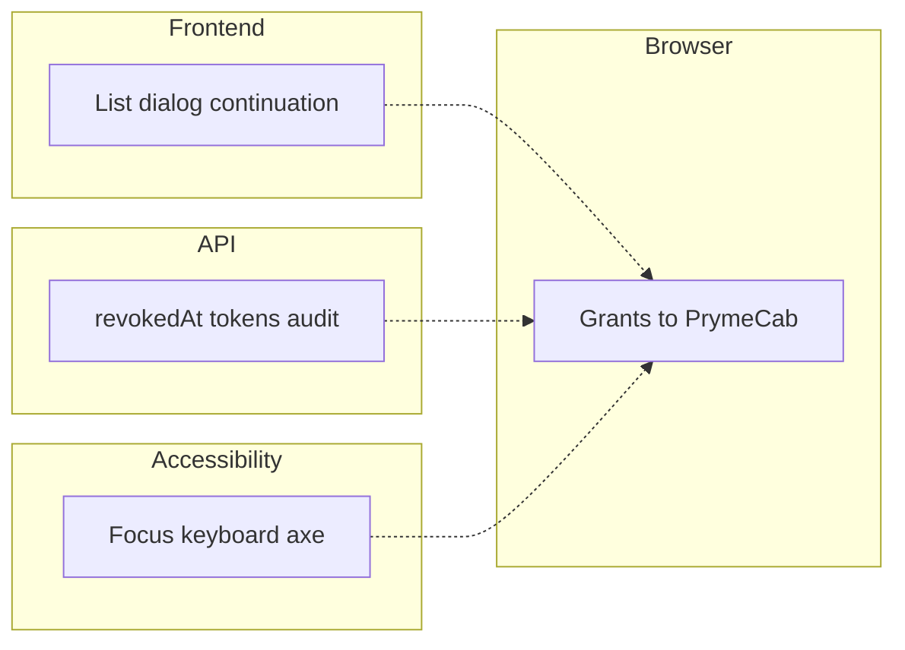

# Sprint 2 Grants UI validation

This document records a fresh automated validation of the **Grants console UI** and the **revocation journey** it drives. It answers whether the implemented system, in the scenarios that already exist in the repository, presents Grants correctly, requires confirmation before revoke, persists revocation without deleting the Grant, and makes previously issued PrymeCab access unusable.

What the feature implements is described in [`SPRINT2-IMPLEMENTATION.md`](./SPRINT2-IMPLEMENTATION.md). This file reports only observed test results from the execution documented below.

---

## 1. Validation purpose

The question was whether the identity owner can inspect application–Context permissions on `/console/grants`, revoke an active Grant through a confirmation dialog, see the Grant remain as **Revoked**, continue to Activity, and observe that PrymeCab can no longer use the previously authorised access.

The validation uses only tests that already exist. It does not introduce new product tests, and it does not treat the presence of a test file as a pass.

---

## 2. Why several test layers are required

The Grants journey crosses three applications (Platform, API, PrymeCab) and two kinds of credential (the owner’s session token and PrymeCab’s application access token). No single layer can answer every question.

- **Frontend component tests** check how the Grants interface presents Active versus Revoked state, whether Revoke is offered, whether Cancel avoids the mutation, and how success and failure are handled. They run quickly and in isolation. They cannot prove that the API persisted `revokedAt` or that PrymeCab lost access.
- **API tests** check owner-only revocation, `revokedAt`, token invalidation, `ACCESS_REVOKED`, repeated revoke, and re-authorisation on the same Grant id. They do not exercise the browser UI.
- **Browser end-to-end tests** drive the real path: consent → Grants UI → confirm revoke → Activity → PrymeCab. They are the only layer that shows those pieces cooperating.
- **Accessibility checks** exercise keyboard operation, accessible names, and automated axe scans. Ordinary functional tests do not.

These layers are complementary. A passing component test does not imply a passing E2E journey, and a passing E2E journey does not replace API checks of idempotency or cross-user rejection.



---

## 3. Validation layers present

### Frontend / component behaviour

**Purpose.** Determine whether the Grants interface presents and changes state correctly in response to user interaction and API outcomes.

Covered by six Vitest files under `apps/securiself-platform/src/features/grants/`.

### Backend / API behaviour

**Purpose.** Determine whether revocation changes persistent permission state and enforces its security consequence independently of the UI.

Covered by Grant-specific cases in `grants-idempotent.test.ts`, `security.test.ts`, `ownership.test.ts`, and `audit.test.ts`.

### PrymeCab access mapping

**Purpose.** Determine how PrymeCab labels a rejected profile read, which is the third-party consequence of revoke.

Covered by two cases in `apps/prymecab-simulator/lib/access-state.test.ts`. This is not Grants UI, but it is the mapping E2E later shows on the landing page.

### Browser end-to-end

**Purpose.** Determine whether the complete user-facing interaction works across Platform, API, and PrymeCab.

Covered by `tests/e2e/specs/grant-revocation.spec.ts` (Chromium).

### Accessibility / interaction

**Purpose.** Determine whether the Grants interaction supports the keyboard, semantic, and axe behaviours exercised by existing checks.

Covered by the dedicated Playwright test “Grants page and revoke dialog pass the a11y gate”, plus component checks for accessible revoke names and Tab to **View Activity**. This is not a WCAG conformance assessment. The broader console axe loop that also visits `/console/grants` was not executed as Sprint 2 evidence.

---

## 4. Execution record

Environment: local machine, 18 August 2026. Frontend tests used Vitest 4.1.9 with jsdom. API tests used Vitest against PostgreSQL. Browser tests used Playwright 1.61.1, Chromium, Platform `localhost:3000`, PrymeCab `localhost:3001`, API `localhost:8080`, isolated E2E database, production `next start` after `pnpm test:e2e:prepare`.

Two Grant API cases (`ownership`, `audit`) failed when started in parallel with other API files on the shared test database (`401 Invalid session token`). They were re-run in isolation and passed. The recorded API results below are those isolated runs. The shared-database collision is an execution constraint of the API suite, not a Grants UI defect.

### Frontend (Platform)

```
pnpm --filter securiself-platform test src/features/grants
```

Files: six under `src/features/grants/`.

```
Test Files  6 passed (6)
     Tests  18 passed (18)
  Duration  2.45s
```

Failed: 0. Skipped: 0.

### Backend (API)

```
pnpm --filter api-backend test tests/grants-idempotent.test.ts
pnpm --filter api-backend exec vitest run tests/security.test.ts -t "rejects a revoked token|lists grants with application|reactivates a revoked grant"
pnpm --filter api-backend exec vitest run tests/ownership.test.ts -t "rejects revoking another user's grant"
pnpm --filter api-backend exec vitest run tests/audit.test.ts -t "records ACCESS_GRANTED, PROFILE_READ and ACCESS_REVOKED"
```

| File | Sprint 2 cases | Result |
| --- | ---: | --- |
| `tests/grants-idempotent.test.ts` | 1 / 1 | 1 passed |
| `tests/security.test.ts` | 3 / 10 | 3 passed, 7 skipped |
| `tests/ownership.test.ts` | 1 / 3 | 1 passed, 2 skipped |
| `tests/audit.test.ts` | 1 / 3 | 1 passed, 2 skipped |

Sprint 2-relevant API cases: **6 passed, 0 failed**.

### PrymeCab mapping

```
pnpm --filter prymecab-simulator exec vitest run lib/access-state.test.ts -t "access_rejected|generic server failure"
```

```
Tests  2 passed | 3 skipped (5)
```

Sprint 2-relevant: **2 passed**. The three skipped cases are anonymous, generic profile success, and network-error mapping.

### Browser E2E

```
pnpm test:e2e:prepare
PLAYWRIGHT_HTML_OPEN=never pnpm exec playwright test tests/e2e/specs/grant-revocation.spec.ts
```

The scenario was executed twice in this session (validation run, then a repeat used for the HTML report figure). Both completed successfully.

```
Running 1 test using 1 worker
  ✓  grant revocation › revokes the active PrymeCab grant through the Grants UI and invalidates access (12.6s)
  1 passed (18.7s)
```

Failed: 0. Skipped: 0.

Evidence: [`e2e-grant-revocation-result.png`](./images/e2e-grant-revocation-result.png).

### Accessibility

```
PLAYWRIGHT_HTML_OPEN=never pnpm exec playwright test tests/e2e/specs/accessibility.spec.ts --grep "Grants page and revoke dialog"
```

```
Running 1 test using 1 worker
  ✘  accessibility @a11y › Grants page and revoke dialog pass the a11y gate (8.4s)
  1 failed
```

The test failed on the open revoke dialog. Axe reported **1 serious** `color-contrast` violation (4 nodes). Critical: 0. The earlier scan of the active Grants page in the same test completed with 0 critical and 0 serious. Keyboard steps that open the dialog completed; Escape dismiss was not reached because the test stopped at the axe assertion.

---

## 5. Coverage by test

| Validation layer | Test / scenario | Behaviour checked | Why it matters | Result |
| --- | --- | --- | --- | --- |
| Frontend | `grant-labels.test.ts` — displayName preferred | Context primary label is `displayName` when present | Owner must recognise which Context was authorised | Passed |
| Frontend | `grant-labels.test.ts` — internalName fallback | Empty or whitespace `displayName` uses `internalName` | Label still identifies the Context | Passed |
| Frontend | `grant-labels.test.ts` — secondary internal name | Secondary text only when it differs from the primary | Avoids duplicating the same name | Passed |
| Frontend | `grant-labels.test.ts` — Active / Revoked | `revokedAt === null` → Active; timestamp → Revoked | Status is derived from persisted state | Passed |
| Frontend | `grant-labels.test.ts` — revoke action name | Accessible name is `Revoke {app} access to {context}` | Distinguishes which permission is revoked | Passed |
| Frontend | `grants-list.test.tsx` — Active + Revoke | Active badge, PrymeCab, AngelaTech, Revoke control | Owner can identify and act on an active Grant | Passed |
| Frontend | `grants-list.test.tsx` — Revoked hides Revoke | Revoked badge; no revoke button | Only an active Grant offers revocation | Passed |
| Frontend | `grants-list.test.tsx` — Cancel | Dialog opens; Cancel does not call mutate | Cancelling must not revoke | Passed |
| Frontend | `grants-list.test.tsx` — confirm success | Confirm calls mutate with grant id and notifies parent | Confirmation is required; success continues the UI | Passed |
| Frontend | `grants-list.test.tsx` — confirm failure | Failed mutate does not notify `onRevoked` | Failure must not show a revoked continuation | Passed |
| Frontend | `grants-page-states.test.tsx` — loading | Heading plus `aria-busy` status | In-flight list fetch is represented | Passed |
| Frontend | `grants-page-states.test.tsx` — empty | “No grants yet” | Empty list is distinct from error | Passed |
| Frontend | `grants-page-states.test.tsx` — error | Retry control present | Failed list fetch is recoverable | Passed |
| Frontend | `revoke-continuation.test.tsx` — copy and link | PrymeCab guidance; **View Activity** → `/console/activity` | Owner can continue to Activity | Passed |
| Frontend | `revoke-continuation.test.tsx` — keyboard | Tab focuses **View Activity** | Continuation control is keyboard-operable | Passed |
| Frontend | `api.test.ts` — list unwrap | `{ status, data }` becomes `Grant[]` | UI consumes the list envelope correctly | Passed |
| Frontend | `api.test.ts` — revoke POST | POST `/api/v1/grants/{id}/revoke`; returns no Grant body | Confirm reaches the existing revoke endpoint | Passed |
| Frontend | `hooks.test.tsx` — cache invalidation | Success invalidates Grants and Activity query keys | List and Activity refresh after revoke | Passed |
| API | `grants-idempotent.test.ts` | First revoke sets `revokedAt` and one `ACCESS_REVOKED`; second keeps timestamp and audit count; profile 401; other user 403; re-authorisation clears `revokedAt` on the same id | Persistence, idempotency, token loss, ownership, Grant not deleted | Passed |
| API | `security.test.ts` — revoked token | Profile 200 before revoke, 401 after | Access tokens for that permission become unusable | Passed |
| API | `security.test.ts` — list fields | Application name/`clientId`, Context category/`internalName`/`displayName`; no client secret | List payload is identifiable and does not leak secrets | Passed |
| API | `security.test.ts` — re-authorisation | Same Grant id, `revokedAt` cleared | Grant row is reused, not deleted | Passed |
| API | `ownership.test.ts` — foreign revoke | Other session 403; owner Grant still `revokedAt: null` | Revoke is owner-only | Passed |
| API | `audit.test.ts` — ACCESS_REVOKED | Audit list contains `ACCESS_REVOKED` after revoke | Revoke is recorded | Passed |
| PrymeCab | `access-state.test.ts` — access_rejected | Maps to `access_lost` | Rejected token is shown as lost access, not a generic error | Passed |
| PrymeCab | `access-state.test.ts` — generic failure | Error copy does not mention revocation | Unrelated failures are not labelled as revoke | Passed |
| E2E | `grant-revocation.spec.ts` | Full Grants UI revoke → Activity → PrymeCab 401 | Integrated journey | Passed |
| Accessibility | Grants page and revoke dialog | Axe on active Grants (pass) and open dialog (fail); Revoke focused + Enter; Escape not reached | Keyboard and automated contrast on the Grants interaction | **Failed** |

### Behaviours not covered by existing tests

These items were in the validation question. The repository does not exercise them automatically:

- **Unrelated permissions remain unaffected.** No test creates two Grants and revokes one. The API updates tokens matching `userId`, `applicationId`, and `contextId` only; that isolation is not asserted.
- **E2E Cancel.** Component tests cover Cancel. The accessibility test uses Escape, but it did not complete in this run and does not re-assert that the Grant stayed Active.
- **Repeated revoke through the UI.** Idempotency is an API check. After refetch the UI omits Revoke (E2E asserts count 0) rather than posting twice.
- **Re-authorisation through the Grants UI.** Reactivation is consent/API only. The Grants page does not restore a Grant.

---

## 6. End-to-end revocation scenario

The committed scenario is `tests/e2e/specs/grant-revocation.spec.ts`. Observable sequence actually exercised:

1. Establish an active PrymeCab Grant by completing Social consent (Context display name **AngelaTech**).
2. Confirm PrymeCab can read the Social profile (HTTP success).
3. Open `/console/grants`.
4. Identify PrymeCab, AngelaTech, **Active**, and the control named `Revoke PrymeCab access to AngelaTech`.
5. Open the confirmation dialog; it states that confirming invalidates active access.
6. Confirm with the dialog’s Revoke control (same accessible name).
7. Dialog closes. Continuation (`revoke-continuation`) is visible, including PrymeCab guidance and **View Activity** (`href` `/console/activity`).
8. The Revoke control for that permission has count 0. Status badge **Revoked** is visible. The Grant row remains.
9. Follow **View Activity**. URL is `/console/activity`. **Access revoked** is visible, with AngelaTech and `Internal name: E2E Social`.
10. Open PrymeCab landing. `access-lost` is visible; previous access is no longer available; **Login with SecuriSelf** is offered; Social profile text is gone.
11. Subsequent PrymeCab profile request is HTTP 401 with `reason: "access_rejected"`.
12. Browser storage must not contain the test client secret prefix `scs_secret_`.

Isolated frontend tests cannot prove that the POST persisted `revokedAt` or that PrymeCab’s cookie stopped working. Isolated API tests cannot prove that the owner reached that outcome by using the Grants confirmation UI, saw continuation, and opened Activity. This scenario is the evidence that those pieces cooperate.

**Evidence.** [`grants-active-permission.png`](./images/grants-active-permission.png), [`grants-revoke-confirmation.png`](./images/grants-revoke-confirmation.png), [`grants-revoked-state.png`](./images/grants-revoked-state.png), [`activity-access-revoked.png`](./images/activity-access-revoked.png), [`prymecab-access-lost.png`](./images/prymecab-access-lost.png), [`e2e-grant-revocation-result.png`](./images/e2e-grant-revocation-result.png).

---

## Visual Evidence

All figures are under [`docs/sprint2/images/`](./images/). Each was taken from this validation session against the running E2E implementation (viewport 1280×720). The E2E owner email is truncated in the chrome; no access tokens or client secrets are shown.

| Figure | What it shows | Validation relevance |
| --- | --- | --- |
| `grants-active-permission.png` | Grants table with PrymeCab, `scs_e2e_prymecab_client`, AngelaTech, Social, Active, Revoke | Owner can view Grants and identify the application–Context permission before revoke |
| `grants-revoke-confirmation.png` | Dialog “Revoke access for PrymeCab?” naming PrymeCab and AngelaTech; Cancel and Revoke access | Revocation requires deliberate confirmation; copy states tokens stop working and nothing is deleted |
| `grants-revoked-state.png` | Same Grant as Revoked, revoked timestamp set, no Revoke action; continuation with View Activity | Frontend reflects persisted revoked state; Grant is not deleted; continuation stays on Grants |
| `activity-access-revoked.png` | Activity newest-first: Access revoked, then Profile read, then Access granted for PrymeCab / AngelaTech | `ACCESS_REVOKED` is visible as **Access revoked** after the UI journey |
| `prymecab-access-lost.png` | PrymeCab landing: previous access no longer available; Login with SecuriSelf | Previously authorised access is unusable in the third-party app |
| `e2e-grant-revocation-result.png` | Playwright HTML report: 1 passed, 0 failed, Chromium, 18.7s | The integrated Grants UI revocation spec completed successfully |

**Filename:** `grants-active-permission.png`

**What it shows.** `/console/grants` with one Active PrymeCab Grant for the AngelaTech Social Context and a Revoke action.

**Claim.** The owner can view Grants and identify the correct application and Context while the permission is active.

**Related scenario.** E2E revocation, steps 3–4.

**Filename:** `grants-revoke-confirmation.png`

**What it shows.** Confirmation dialog over the still-Active row. Copy states that confirming invalidates access for PrymeCab and AngelaTech without deleting the Context, application, or activity history.

**Claim.** Revoke is gated on confirmation that names the permission.

**Related scenario.** E2E revocation, steps 5–6.

**Filename:** `grants-revoked-state.png`

**What it shows.** Toast “Grant revoked”; continuation alert with **View Activity** and PrymeCab guidance; table row Status **Revoked**, Revoked column filled, Actions empty.

**Claim.** After success the same Grant remains visible as Revoked, without a Revoke control, and the owner is directed to Activity and PrymeCab rather than redirected away.

**Related scenario.** E2E revocation, steps 7–8.

**Filename:** `activity-access-revoked.png`

**What it shows.** Activity log with **Access revoked** for PrymeCab / AngelaTech (`Internal name: E2E Social`), above Profile read and Access granted.

**Claim.** Following continuation, Activity shows the revoke event for that application–Context pair.

**Related scenario.** E2E revocation, step 9.

**Filename:** `prymecab-access-lost.png`

**What it shows.** PrymeCab landing card: previous SecuriSelf access is no longer available; authorise again to restore access; Login with SecuriSelf. No Social profile.

**Claim.** After Grants UI revoke, PrymeCab cannot present the previously authorised profile.

**Related scenario.** E2E revocation, step 10.

**Filename:** `e2e-grant-revocation-result.png`

**What it shows.** Playwright report for `grant-revocation.spec.ts`: 1 passed, 0 failed, 0 skipped, Chromium, 18.7s (test 12.6s).

**Claim.** The committed Grants UI revocation browser test completed successfully on this execution.

**Related scenario.** Results summary (E2E).

---

## 7. Results synthesis

**Frontend behaviour.** 18/18 Platform Grants tests passed. They show Active versus Revoked presentation, Revoke only on active Grants, confirmation before mutate, Cancel without mutate, failure without continuation, loading/empty/error page states, continuation to Activity, and cache invalidation after success.

**Backend revocation enforcement.** 6/6 Sprint 2-relevant API cases passed (isolated runs). They show owner-only revoke, `revokedAt` set without deleting the Grant, associated profile access 401, one `ACCESS_REVOKED` on first revoke, no second audit on repeat revoke, and re-authorisation clearing `revokedAt` on the same id. Unrelated-permission isolation was not tested.

**Integrated browser journey.** 1/1 E2E Grants revocation test passed. Consent, Grants UI confirm, revoked row and continuation, Activity **Access revoked**, PrymeCab access-lost, and profile 401 `access_rejected` were all observed.

**PrymeCab mapping.** 2/2 relevant unit cases passed: `access_rejected` → `access_lost`; generic failure is not labelled as revocation.

**Accessibility-specific checks.** Component tests passed for accessible revoke names and Tab to **View Activity**. The dedicated Playwright Grants a11y test **failed**: axe `color-contrast` (serious) on the open revoke dialog (4 nodes: application and Context emphasis in the description, Cancel, and Revoke access). The active Grants page scan in that test had 0 critical and 0 serious. Keyboard focus and Enter opened the dialog; Escape dismiss was not executed. This run does not establish WCAG conformance.

---

## 8. Validation boundaries

- Browser automation used Chromium only.
- Automated accessibility covers the Grants interactions in the executed tests. It is not a complete WCAG assessment and does not replace assistive-technology testing.
- The executed tests demonstrate the defined scenarios. They do not demonstrate production-scale load or concurrent owners.
- API Grant tests share one database and must be run without overlapping workers; a concurrent first attempt in this session was invalid and was replaced by isolated runs.

---

## 9. Conclusion

Yes, for the user-facing Grants revocation journey and its system-level consequence in the tested scenarios. Frontend Grants tests passed (18/18). Sprint 2-relevant API revocation cases passed (6/6). The Chromium E2E spec passed (1/1): the owner revoked the active PrymeCab Grant through the Grants UI, the Grant remained as Revoked, Activity showed **Access revoked**, and PrymeCab could no longer retrieve the profile (HTTP 401, `access_rejected`).

The dedicated Grants accessibility test did not pass. Axe reported a serious colour-contrast violation on the open revoke dialog. Keyboard confirmation of that dialog was not fully completed in that test because execution stopped at the axe assertion.

These results apply to the executed Sprint 2 Grants UI and revocation scenarios only.
