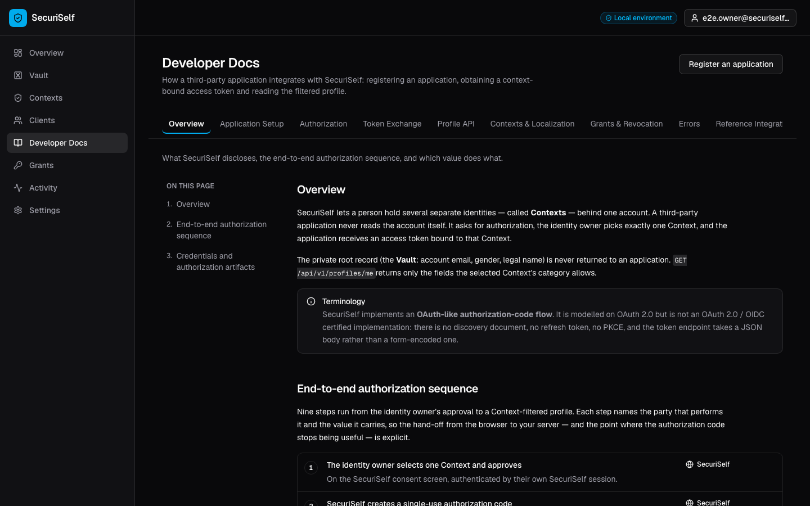
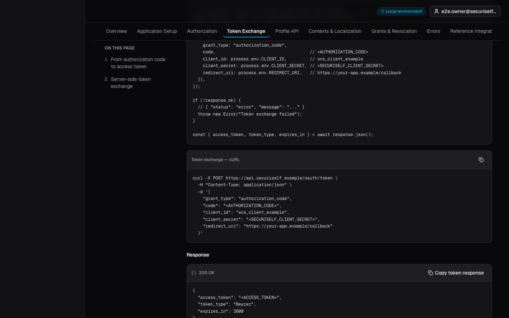
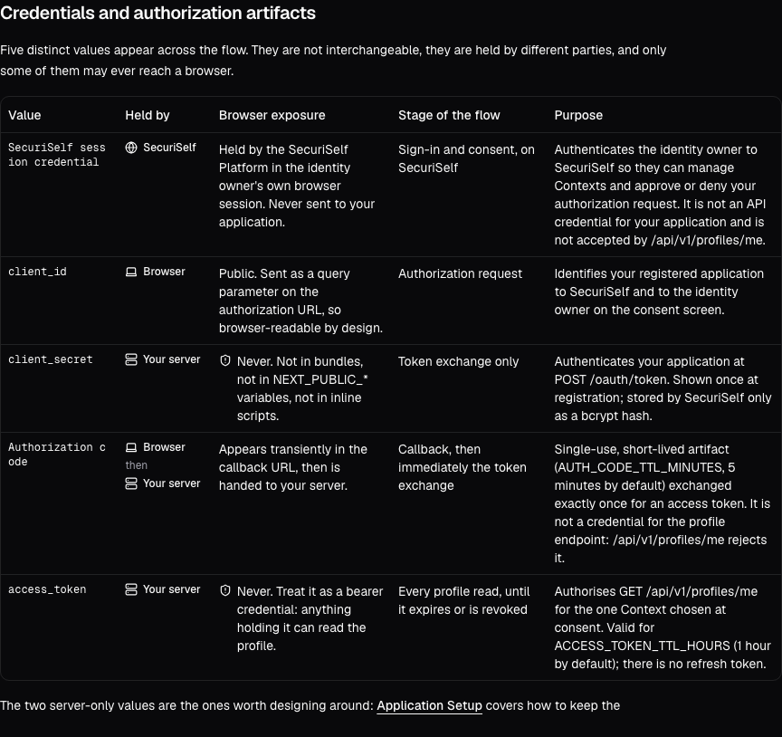
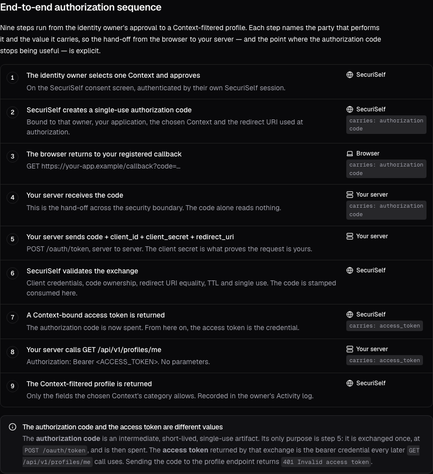
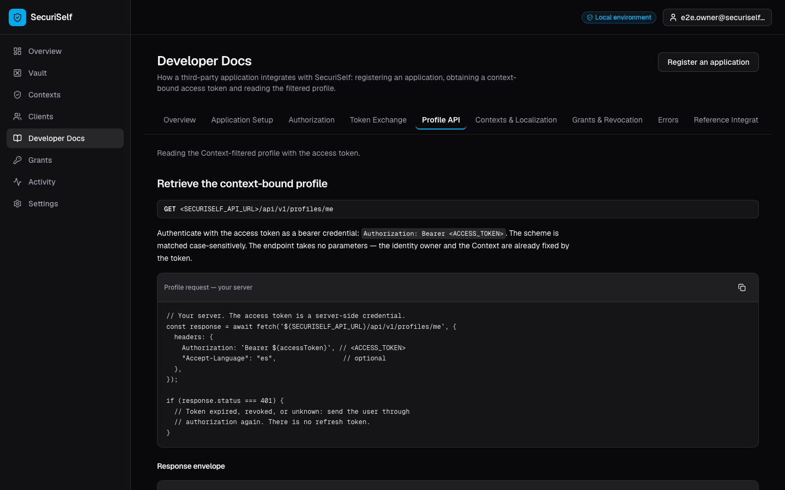
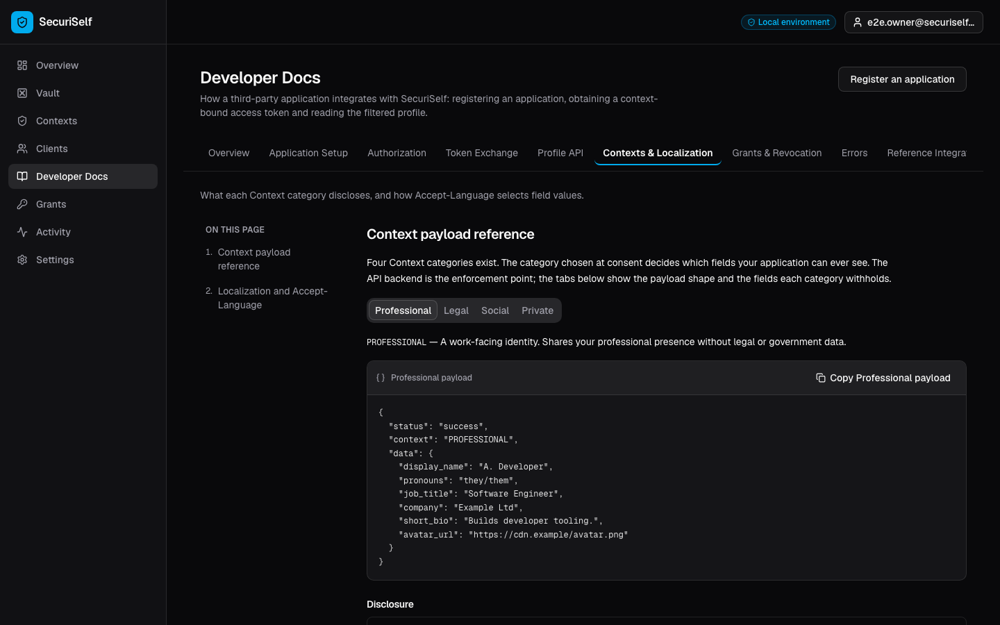

# Sprint 5 — Final Summary: Integrated Developer Documentation

**Synthesis of** [`sprint5-implementation.md`](./sprint5-implementation.md) ·
[`sprint5-validation.md`](./sprint5-validation.md) ·
[`sprint5-external-evaluation.md`](./sprint5-external-evaluation.md) ·
[`sprint5-post-evaluation-refinement.md`](./sprint5-post-evaluation-refinement.md) ·
[`sprint5-post-validation.md`](./sprint5-post-validation.md) ·
[`images/evidence.md`](./images/evidence.md) ·
[`images/post-validation-evidence.md`](./images/post-validation-evidence.md)

This document answers one question: why Developer Documentation was necessary, how it
was implemented, how it was validated, what five external developers revealed, how the
implementation changed in response, and what evidence supports the final outcome.

---

## 1. Sprint 5 Objective

By the end of Sprint 4 the SecuriSelf third-party integration contract was complete and
exercised end to end. The API backend implemented the OAuth-like authorization-code flow
(`apps/api-backend/src/modules/oauth/oauth.service.ts`), context-bound access tokens
(`src/middleware/requireBearerToken.ts`), the privacy filter that produces the
third-party payload (`src/modules/profiles/profiles.service.ts`), `Accept-Language`
resolution (`src/lib/locale.ts`) and Grants with idempotent revocation
(`src/modules/grants/grants.service.ts`). The PrymeCab simulator consumed the whole flow
as a real third party.

The remaining problem was therefore not behavioural but **epistemic**. Every fact a
third-party developer needs — that the authorization request goes to the Platform and not
the API, that `redirect_uri` is compared by exact string equality, that the token endpoint
takes a JSON body, that an authorization code is single-use with a five-minute default
TTL, that there is no refresh token, that `pronouns` resolves to the literal string
`"hidden"` rather than `null`, that revocation surfaces as
`401 Access token has been revoked` — existed only inside source code, the Prisma schema,
the Zod schemas, the test suite and the PrymeCab implementation. Reproducing the
integration required read access to the repository.

For an API-first identity platform this is a contract defect, not a documentation
nicety. A technical integration cannot be treated as reproducible if its external
contract is discoverable only by inspecting the implementation: the boundary between
"what the system happens to do" and "what the system promises" does not exist, and a
third-party developer cannot distinguish a guaranteed behaviour from an incidental one.
The product claim — that third parties consume identity data under user-selected
constraints — is unverifiable from outside.

**Sprint objective.** *Transform the already validated SecuriSelf third-party integration
flow into a self-contained Developer Documentation surface that carries an external
developer from application registration to a successful context-bound profile read,
including the failure and revocation paths, without requiring inspection of SecuriSelf or
PrymeCab source code.*

**Scope boundary.** Sprint 5 added no runtime behaviour to the integration. It did not
implement or modify the OAuth flow, the privacy filter, Context categories, localization,
Grants, revocation, Google authentication or PrymeCab; those were treated as the
specification the documentation had to match. Outside the new feature directory and route,
the initial Sprint touched three files: a navigation entry in `console-sidebar.tsx`, a
route constant in `routes.ts`, and one additive optional prop (`copyLabel`) on the shared
`PayloadPreview`. No backend file was modified at any point in the Sprint.

---

## 2. Why Developer Documentation Was Required

The integration exposes a set of concepts that must each be understood correctly, and
several of which fail silently when misunderstood:

| Concept | Consequence of misunderstanding |
| --- | --- |
| Application registration, `client_id`, one-time `client_secret` | A lost secret requires rotation; a leaked secret lets an attacker complete the exchange under the application's identity |
| Exact-string `redirect_uri` matching | Authorization or exchange rejected with no obvious cause |
| Browser authorization request vs. server-side token exchange | The single most damaging integrator error: `client_secret` shipped to the browser |
| Owner authentication and Context selection at consent | Misattributing the owner's SecuriSelf session to the application |
| Authorization code → access token | Sending the code to `/profiles/me`, which rejects it |
| Context-bound token and `/api/v1/profiles/me` | Expecting to request arbitrary fields |
| Context field filtering | Assuming absent fields mean absent data |
| `Accept-Language` localization | Assuming a language choice widens disclosure |
| Grants and revocation | No revocation callback exists; access ends as a `401` on the next read |
| Error behaviour | Failure states are precisely what a happy-path example cannot teach |

All of these behaviours existed and were tested before Sprint 5. Their existence in
source code is not an external developer contract. **Sprint 5 documented and exposed
them; it did not implement them.**

---

## 3. How the Documented Integration Works

The documentation had to communicate one causal chain, in which each link constrains the
next:

```text
Application registration  (Console)
        ↓
client_id + one-time client_secret
        ↓
Browser → SecuriSelf /oauth/authorize
        ↓
Identity owner authenticates and selects exactly one Context
        ↓
Authorization code  (single-use, AUTH_CODE_TTL_MINUTES, 5 min default)
        ↓
Third-party server → POST /oauth/token  (code + client_id + client_secret + redirect_uri)
        ↓
Context-bound access token  (ACCESS_TOKEN_TTL_HOURS, 1 h default, no refresh token)
        ↓
GET /api/v1/profiles/me  (Authorization: Bearer …, no parameters)
        ↓
Context-filtered profile
```

**Browser boundary.** `client_id` and `redirect_uri` legitimately appear in a browser URL,
and the authorization code appears transiently in the callback URL. Nothing at this stage
proves the application's identity.

**Server boundary.** `client_secret` and `access_token` are server-only. `POST /oauth/token`
verifies the secret with bcrypt against `application.clientSecretHash` and returns
`401 Invalid client credentials` for both an unknown `client_id` and a wrong secret; the
authorization code alone therefore proves nothing. The access token is equally a bearer
credential with no proof of possession — `requireBearerToken` grants the read on a
`sha256(raw)` match — which is why it is server-side state. The flow's shape actively
invites the error: a developer generalising from the authorization step to the exchange
step will reach for `NEXT_PUBLIC_CLIENT_SECRET`.

**Context binding.** The third party never chooses fields. The code is bound to one owner,
one application, one Context and one redirect URI; the exchanged token inherits that
binding; `/profiles/me` accepts no parameters because owner and Context are already fixed.
The response `data` object is assembled field by field from the category's allow-list
rather than serialised from the user record with fields removed, so a field added to the
database later cannot appear in an existing category's payload.

**Localization.** `Accept-Language` substitutes a value for an already-authorized
localisable field. It does not change the authorized Context and does not widen the
allow-list: requesting `es` on a `SOCIAL` Context returns the same four `SOCIAL` fields.

**Revocation.** Revoking a Grant marks it, revokes every non-revoked token for that
user/application/Context triple in the same transaction, and writes one `ACCESS_REVOKED`
audit entry; a second revoke is idempotent. The application is not notified — it learns of
revocation as `401 Access token has been revoked` on its next read, the same status class
as expiry, so one handler covers both. Re-authorization is the only recovery, because no
refresh token exists.

---

## 4. Initial Implementation

The Sprint added an authenticated route at `/console/docs`, registered as
`routes.console.docs` and surfaced in the Console sidebar between `Clients` and `Grants` —
the point in the navigation where a developer who has just registered an application would
look next. The page presented **twelve sections in integration order**: Overview; Register
an application; Credentials and the security boundary; Authorization request;
Authorization code callback; Server-side token exchange; Retrieve the context-bound
profile; Context payload reference; Localization and `Accept-Language`; Grants and
revocation; Error reference; PrymeCab reference integration.

Three implementation decisions carried the design.

**Documentation inside the authenticated Console, not a separate site.** The audience is a
developer who is also registering an application, and registration is Console-only.
Placing the docs at `/console/docs` puts them under the same `AuthGuard` and
`ConsoleShell` as `Clients`, so every "do this in the Console" instruction is one click
from its subject via `routes.console.*` rather than described in prose, and no new
authentication, layout or theming path was introduced. The cost — the docs are not
publicly readable — is recorded in §10.

**Static typed TSX, not a documentation framework.** MDX, Docusaurus or a schema-to-docs
generator would have added a build pipeline, a second styling system and a second
deployment target to document a contract of roughly a dozen sections. Static TSX reuses
the Console shell, the shadcn/Radix primitives, the theme tokens and the existing test and
accessibility harnesses at zero infrastructure cost — and, more importantly, lets the
documentation *import live application code* so that some content is computed rather than
transcribed.

**A minimal component boundary.** Four components (`DocsSection`, `DocsNav`, `CodeBlock`
and the page) plus small in-file presentational helpers used many times each. Prose used
once stayed inline rather than being pushed into a content model invented for a single
consumer.

> Sprint 5 added a documentation interface around the existing integration contract; it
> did not introduce a new authorization protocol.

---

## 5. Technically Significant Implementation Code

Six excerpts, selected because each resolves a specific Sprint problem rather than because
it is new. Paths are as they stand after the post-evaluation refinement.

### 5.1 One registry driving tabs, navigation, headings and routes

**File:** [`src/features/developer-docs/developer-docs.ts`](../../apps/securiself-platform/src/features/developer-docs/developer-docs.ts)

```ts
export const DOCS_AREAS: DocsAreaMeta[] = [
  { slug: "", label: "Overview", summary: "…", sections: [
      { id: "overview", title: "Overview" },
      { id: "flow", title: "End-to-end authorization sequence" },
      { id: "artifacts", title: "Credentials and authorization artifacts" },
  ]},
  // … eight more areas
];

const DOCS_SECTIONS = DOCS_AREAS.flatMap((area) => area.sections);

/** Section title lookup, so a heading and its nav entry cannot drift apart. */
export const SECTION_TITLE: Record<string, string> = Object.fromEntries(
  DOCS_SECTIONS.map((section) => [section.id, section.title]),
);
```

**Purpose.** Prevent the four representations of a documentation unit — the tab label, the
section-navigation entry, the `id` on the `<section>`, and the visible `<h2>` — from
diverging. **Mechanism.** One array feeds the tab bar, the per-area section list,
`generateStaticParams`, and the headings via `SECTION_TITLE`; `DocsSection` derives both
the anchor target and its `aria-labelledby` heading id from the same `id`. **Result.**
Every navigation link resolves to an existing landmark, and every landmark carries the
title shown in the navigation. **Importance.** Broken in-page anchors are the
characteristic failure mode of hand-written documentation and are invisible in a
screenshot. Here the invariant is machine-checkable, and the component suite iterates the
registry rather than a hard-coded list. The pre-refinement page held exactly this invariant
for its twelve sections; splitting into routes would otherwise have been the moment it
broke.

### 5.2 Nine routes from one file

**File:** [`app/console/docs/[[...area]]/page.tsx`](../../apps/securiself-platform/app/console/docs/%5B%5B...area%5D%5D/page.tsx)

```tsx
export function generateStaticParams() {
  return DOCS_AREAS.map((area) => ({ area: area.slug ? [area.slug] : [] }));
}

export default async function DeveloperDocsAreaPage({ params }: {
  params: Promise<{ area?: string[] }>;
}) {
  const { area: segments = [] } = await params;
  const meta = segments.length > 1 ? undefined : findDocsArea(segments[0] ?? "");
  if (!meta) notFound();
  return <DocsAreaView area={meta} />;
}
```

**Purpose.** Turn a URL into one documentation area, or a 404. **Mechanism.** An optional
catch-all lets `/console/docs` and `/console/docs/<slug>` share one file;
`generateStaticParams` enumerates the nine valid slugs so the build prerenders each as
static HTML. **Result.** Nine independently addressable, bookmarkable, prerendered routes;
an unknown slug reaches `notFound()`. **Importance.** Nine routes with no per-route
boilerplate and no routing abstraction — the alternative was nine near-identical
`page.tsx` files, each a place for the registry invariant to be violated.

### 5.3 Payload examples computed from the application's own builder

**File:** [`src/features/developer-docs/components/context-payload-tabs.tsx`](../../apps/securiself-platform/src/features/developer-docs/components/context-payload-tabs.tsx)

```tsx
{CONTEXT_CATEGORIES.map((category) => (
  <TabsContent key={category.value} value={category.value}>
    <PayloadPreview
      copyLabel={`Copy ${category.shortLabel} payload`}
      payload={{ status: "success", context: category.value,
        data: buildProfilePayload(category.value, EXAMPLE_CONTEXT, EXAMPLE_VAULT) }}
    />
    {getPrivacyMatrix(category.value).map((rule) => (
      <PrivacyFieldRow key={rule.label} {...rule} />
    ))}
  </TabsContent>
))}
```

**Purpose.** Show what each Context category discloses without hand-writing four JSON
documents that would silently rot. **Mechanism.** The tab set is generated from the shared
category metadata; each tab builds its payload at render time through the same
`buildProfilePayload` the consent screen uses, and renders the category's disclosure matrix
through the existing `PrivacyFieldRow`. **Result.** Four payloads and four matrices that
are, by construction, the frontend's canonical view of the filter rather than a
transcription of it; a fifth Context category would produce a fifth documentation tab with
no edit to the docs. **Importance.** A change to disclosure rules cannot leave the docs
showing the old shape, and `buildProfilePayload` is itself pinned by
`features/contexts/context-rules.test.ts`. This is the strongest form of documentation
fidelity the Sprint achieved, and it is why the payload reference is the section external
participants rated highest (§7).

### 5.4 A typed projection of the backend's localisable fields

**File:** [`src/features/developer-docs/developer-docs.ts`](../../apps/securiself-platform/src/features/developer-docs/developer-docs.ts)

```ts
/**
 * Fields the API backend resolves through the localization helper, per category.
 * Derived from `filterProfile` in profiles.service.ts — the disclosed payload,
 * not the set of fields a context can store.
 */
export const LOCALISABLE_RESPONSE_FIELDS: Record<ContextCategory, string[]> = {
  PROFESSIONAL: ["pronouns", "job_title", "short_bio"],
  SOCIAL: ["pronouns"],
  PRIVATE: ["pronouns"],
  LEGAL: [],
};
```

**Purpose.** State, per category, which response fields respond to `Accept-Language`.
**Mechanism.** A `Record<ContextCategory, string[]>` consumed twice — in the payload tabs
and in the localization table. **Result.** A per-category statement that deliberately
differs from `CATEGORY_LOCALISABLE_FIELDS` in `context-rules.ts`: a `PRIVATE` Context can
*store* a localisable `shortBio` but never *discloses* `short_bio`, so its documented
response set is `["pronouns"]` alone. **Importance.** This is the Sprint's clearest
maintainability trade-off, and the type is what bounds it. Adding a `ContextCategory`
produces a compile-time error until the mapping is extended, which `pnpm check-types`
catches; changing which fields an *existing* category discloses does not, because the
values are strings. That residual manual link is stated in the source comment and carried
forward as a boundary (§10).

### 5.5 Sticky area navigation as links, not a tablist

**File:** [`src/features/developer-docs/components/docs-tabs.tsx`](../../apps/securiself-platform/src/features/developer-docs/components/docs-tabs.tsx)

```tsx
<nav aria-label="Documentation areas"
     className="sticky top-16 z-20 -mx-4 border-b bg-background/95 px-4 backdrop-blur …">
  <ul className="flex gap-1 overflow-x-auto py-2">
    {DOCS_AREAS.map((area) => {
      const active = pathname === docsAreaHref(area.slug);
      return (
        <li key={area.slug || "overview"}>
          <Link href={docsAreaHref(area.slug)}
                aria-current={active ? "page" : undefined}
                className={cn("… border-b-2 …",
                  active ? "border-primary font-semibold text-foreground"
                         : "border-transparent text-muted-foreground …")}>
            {area.label}
          </Link>
        </li>
      );
    })}
  </ul>
</nav>
```

**Purpose.** Keep every integration stage one click away while the reader is deep in one
of them. **Mechanism.** `sticky top-16` pins the bar immediately below the `h-16` sticky
Console topbar; `z-20` keeps it under the topbar's `z-30`; `overflow-x-auto` handles narrow
viewports. **Result.** A persistent, keyboard-traversable area bar whose current entry is
marked three ways. **Importance.** Because each area is a real route, plain links give
browser history, deep linking and ordinary Tab-key traversal with no roving-tabindex logic
to get wrong — an ARIA tablist would have re-implemented all of it. The active state is
carried by `aria-current`, a bottom border *and* font weight, never by colour alone.

### 5.6 The one-line Console fix that made sticky actually stick

**File:** [`src/components/layout/console-shell.tsx`](../../apps/securiself-platform/src/components/layout/console-shell.tsx)

```tsx
{/* No `overflow-y-auto`: it makes `main` a scroll container that never
    actually scrolls (the window does), which silently disables
    `position: sticky` for everything inside it — including the
    Developer Docs area and section navigation. */}
<main className="flex-1">
```

**Purpose.** Make Change 2 work. **Mechanism.** `overflow-y-auto` made `main` a scroll
container, so `position: sticky` inside it resolved against `main`'s scrollport — and
`main` never scrolls (it is `flex-1` inside a `min-h-dvh` column; the *window* scrolls).
Every sticky descendant therefore scrolled away with the page. The Console topbar was
unaffected because it is a sibling of `main`, not a descendant. **Result.** Both navigation
levels stay pinned under real scrolling. **Importance.** This defect was found by
post-refinement browser validation, not by the component suite, the type checker, the
linter or the build — all of which were green with the sticky classes inert. It is the
clearest demonstration in the Sprint that asserting a CSS class is not asserting a
behaviour.

---

## 6. Initial Technical Validation and What It Established

### 6.1 Strategy

Five layers were used, each answering a question the others cannot. The recurring
distinction throughout Sprint 5 is that a frontend test asserting the words
"Access token has been revoked" appear on a page is *documentation-coverage* evidence, not
evidence that revocation works.

| Layer | Question it answers | Result |
| --- | --- | --- |
| Type validation (`pnpm check-types`, `tsc --noEmit`, 3 packages) | Do the typed mappings remain structurally complete — notably `Record<ContextCategory, …>`? | Pass |
| Lint + typecheck together (`turbo run lint check-types --force`) | Any lint or type error in any package? | **5 successful / 5 total**, uncached |
| Platform component tests (`pnpm test:platform`, Vitest + RTL) | Does the Docs structure render — every section, every anchor, every marker, every distinct copy-button name? | **62 passed / 62**, 15 files |
| Backend suite (`pnpm test:backend`, Vitest + Supertest, PostgreSQL) | Do the documented API behaviours remain valid and enforced? | **67 passed / 67**, 11 files |
| Browser E2E (Playwright, Chromium) | Can the protected interface be reached and used in a real browser through the real auth boundary? | Both new `@sprint5` tests passed; suite **10 / 10** with `--retries=2` |
| Production build (`turbo run build --force`) | Does the route exist as a real, cost-free artefact? | **3 / 3**; `/console/docs` listed `○ (Static)` |
| Accessibility (`pnpm test:a11y`, axe `wcag2a/2aa/21a/21aa`) | Any critical or serious violation on the new surface? | `/console/docs`: **0 / 0 / 0 / 0**, 0 incomplete, pass |

Three browser/component tests were added to close six audited gaps — authenticated access
through the guard, the unauthenticated→sign-in→docs boundary, sidebar navigation by click,
in-page anchor navigation actually reaching its target, the four Context categories being
represented, and the absence of permanent visual evidence. No test was added for anything
the Sprint 1–4 suites already covered.

### 6.2 What the initial validation established, and what it could not

Established: all twelve sections rendered as `<h2>` headings with matching anchors; all
twelve navigation links resolved to existing targets; fourteen protocol-level markers
spanning authorization, exchange, read, localization and two failure messages were present;
the route was reachable only through the existing Console auth boundary, with a `returnTo`
round-trip; the four Context categories were represented; the page rendered placeholders
only, asserted by a test that fails if any string carrying the real generated-secret prefix
(`scs_secret_scs`) appears; and the 67 backend tests confirmed that the behaviours the
documentation describes were still enforced.

Not established — and explicitly not claimed:

> Can an unfamiliar external developer actually understand this documentation and complete
> an integration from it?

Every assertion above is a machine checking for the presence and structure of text.
Comprehensibility, ordering for a first-time reader, and sufficiency of explanation are
outside what any of these layers can detect. That gap is precisely what motivated the
external developer evaluation.

---

## 7. External Developer Evaluation

### 7.1 Design

The evaluation was conducted **in person with five developers**, individually, using the
same task sequence and scenario. The first two participants had more advanced development
experience; the remaining three were junior developers. Each acted as a developer
integrating a fictional application, **Northstar Careers**, requiring access to a user's
`PROFESSIONAL` Context. Participants used **only** the Developer Docs inside the Console;
they were not permitted to inspect SecuriSelf or PrymeCab source code, repository files,
implementation notes, README files or external web documentation.

The instrument comprised **eight guided integration tasks** (locating the Docs;
registering an application; constructing the authorization request; understanding Context
selection and consent; handling the callback and server-side token exchange; retrieving
`GET /api/v1/profiles/me`; using `Accept-Language`; understanding revocation and common
failure conditions), followed by **nine closed technical comprehension questions**, one
final question about missing information, **ten five-point ratings** and open-ended
feedback.

Facilitator involvement was recorded: **P01, P02 and P05 completed the evaluation without
assistance; P03 and P04 asked some questions during the session.** The evaluation records
do not document the wording or extent of the facilitator's responses to P03 and P04, so
those sessions are treated as involving facilitator interaction, and no claim is made that
those two participants completed the evaluation independently.

### 7.2 Results

| Aggregate metric | Value |
| --- | --- |
| Participants | 5 (2 more advanced, 3 junior) |
| Guided task responses completed | **40 / 40** |
| Final closed comprehension responses aligned with documented behaviour | **45 / 45** |
| Participants able to proceed without source-code inspection | **5 / 5** |
| Participants completing without facilitator assistance | **3 / 5 (60 %)** |
| Critical integration omissions observed | **0** |
| Mean across all 50 ratings | **4.22 / 5** |
| Ratings of 4 or 5 | **38 / 50 (76 %)** |

Per-statement means (participants rating 4–5 in brackets): documentation discoverable
**5.0** (5/5); Context payload reference **4.6** (5/5); request/code examples **4.6** (5/5);
tasks completable without source code **4.6** (5/5); browser-vs-server responsibilities
**4.0** (3/5); localization **4.0** (3/5); revocation and errors **4.0** (3/5); overall
sequence easy to follow **3.8** (3/5); credentials/artefacts distinction clear **3.8**
(3/5); confidence beginning an integration **3.8** (3/5).

### 7.3 Principal findings

**Technical completeness.** No participant identified a critical integration step as
missing. All five located registration, authorization, callback handling, server-side token
exchange, profile retrieval, localization, revocation and failure conditions. This is the
Sprint's completeness objective met *for the tested scenario*; it does not establish that
every possible third-party use case is documented.

**Context disclosure was among the clearest concepts.** At 4.6/5 with 5/5 rating 4–5,
participants correctly understood that selecting `PROFESSIONAL` constrained the third-party
profile and granted no access to `LEGAL`, Vault or unrelated attributes — the central
SecuriSelf privacy invariant.

**Code and request examples were effective.** Also 4.6/5 with 5/5 at 4–5. Participants
reproduced the authorization URL structure, the `POST /oauth/token` request and the
`GET /api/v1/profiles/me` request correctly. The evidence therefore argued for *retaining*
these, not replacing them with prose.

**The dominant weakness was information architecture, not technical content.** Across both
experience groups, participants described repeatedly scrolling between authorization, token
exchange, profile, localization and error material presented as one continuous twelve-
section page, and losing their position while doing so. The complaint was consistently
about navigation, grouping and visual separation — which means the corrective action is to
restructure existing material, not to add more.

**Credential comprehension was the principal conceptual friction.** Several participants
reread material to separate the SecuriSelf user session, `client_id`, `client_secret`, the
authorization code and the access token. The most frequent confusion was **authorization
code versus access token**, followed by **the owner's SecuriSelf session versus the
third-party access token**. Final answers were correct; the cost was rereading. The mixed
experience sample mattered here: the final answers alone would have suggested near-complete
comprehension, and it was the junior responses that exposed the reconciliation effort
behind them.

All results are bounded to this five-participant task sequence. They are formative evidence
of comprehension and documentation usability, not proof of universal developer usability.

---

## 8. Evidence-Derived Changes

Four changes were prioritised because each corresponds to a difficulty that recurred
**across participants and across experience levels**, and each affects either movement
through the documentation or interpretation of the integration sequence. Prioritisation
reflects recurrence, not unanimity — P02 reported no credential confusion, and P03's
difficulty was navigation alone.

### Change 1 — Focused documentation areas

*Evidence:* Finding 2 (architecture, not content) and Finding 4 (tabs or dedicated pages
preferred), recommended by P01, P02, P04 and P05. *Problem:* participants needed to hold
information from more than one stage at once — the redirect URI at authorization and the
identical redirect URI in the token exchange body — and paid a scrolling cost each time
they moved back. *Response:* the single page was divided into **nine focused areas**, each
its own URL:

| Area | Route | Sections |
| --- | --- | --- |
| Overview | `/console/docs` | Overview; End-to-end authorization sequence; Credentials and authorization artifacts |
| Application Setup | `/console/docs/setup` | Register an application; Credentials and the security boundary |
| Authorization | `/console/docs/authorization` | Authorization request; Authorization code callback |
| Token Exchange | `/console/docs/token-exchange` | From authorization code to access token; Server-side token exchange |
| Profile API | `/console/docs/profile-api` | Retrieve the context-bound profile |
| Contexts & Localization | `/console/docs/contexts` | Context payload reference; Localization and Accept-Language |
| Grants & Revocation | `/console/docs/grants` | Grants and revocation |
| Errors | `/console/docs/errors` | Error reference |
| Reference Integration | `/console/docs/reference-integration` | PrymeCab reference integration |

This is the grouping the evaluation itself proposed, with one deviation justified by
Findings 5 and 8: the credential reference and the end-to-end sequence were placed on
**Overview** rather than inside Application Setup, because the credential model is what
junior participants needed *before* reading any individual stage. Returning to an earlier
stage is now a single navigation rather than a scroll search, and each stage is
bookmarkable and shareable.

### Change 2 — Sticky documentation navigation

*Evidence:* Finding 3, explicitly recommended by P01, P03 and P04. *Problem:* the
"On this page" list scrolled out of view and stopped providing orientation once the reader
was deep in the document. *Response:* two persistent levels in a deliberate hierarchy —
`Console sidebar → Documentation areas (sticky tab bar) → Sections in this area (sticky
aside) → content`. The area bar is pinned at `sticky top-16` under the `h-16` topbar
(§5.5); the per-area section list sits in an `lg:sticky lg:top-32` aside, rendered only for
the four areas with more than one section, with a `<details>` disclosure below the `lg`
breakpoint. `DocsSection` anchors moved from `scroll-mt-20` to `scroll-mt-32` so a jump
does not place an `h2` behind the two bars, and each area ends with a
`<nav aria-label="Documentation sequence">` carrying Previous/Next links, preserving the
linear reading path the single page provided for free.

### Change 3 — Credential and authorization-artifact lifecycle reference

*Evidence:* Finding 5, with P05 explicitly asking for a credential comparison table or
diagram and P01 and P04 reporting the same confusion; supported by the 3.8/5 rating on
"difference between credentials and authorization artefacts was clear". *Response:* **a
table, not a diagram** — the recorded friction was about the *attributes* of each value
(who holds it, whether a browser may see it, when it is used, what it authorises), which a
row/column layout states precisely and a boxes-and-arrows picture only implies. It renders
`CREDENTIAL_LIFECYCLE` into a semantic `<table>` with a `<caption>`, `<thead>` and real
`<th>` headers, over five columns: Value, Held by, Browser exposure, Stage of the flow,
Purpose.

| Value | Held by | Browser exposure | Stage |
| --- | --- | --- | --- |
| SecuriSelf session credential | SecuriSelf | Held by the Platform in the owner's own browser session; never sent to your application; not accepted by `/profiles/me` | Sign-in and consent |
| `client_id` | Browser | Public — a query parameter, browser-readable by design | Authorization request |
| `client_secret` | Your server | **Never.** Not in bundles, `NEXT_PUBLIC_*` or inline scripts | Token exchange only |
| Authorization code | Browser **then** Your server | Transient in the callback URL, then handed to your server; `/profiles/me` rejects it | Callback, then immediately the exchange |
| `access_token` | Your server | **Never.** Treat as a bearer credential | Every profile read, until expiry or revocation |

The two conflated pairs are now adjacent rows differing in every column. `holder` is an
ordered list, so the one value that crosses the boundary renders two labelled tags
separated by the word "then" rather than needing a special case; `serverOnly: true` drives
both a shield icon **and** the opening word "Never", so the boundary is never signalled by
colour alone. Wording was checked against the implementation rather than copied from the
evaluation's illustrative table, which corrected two claims: the SecuriSelf session is
described as held in the owner's own browser session (`securiself.auth`) rather than as an
opaque platform-internal value, and the authorization code row states that the profile
endpoint rejects it, so the table cannot be read as implying the code is a long-term
credential.

### Change 4 — Explicit authorization-code → access-token causality

*Evidence:* Finding 5's single most frequent confusion, plus the 3.8/5 on "overall
integration sequence was easy to follow". *Response:* a nine-step ordered sequence naming,
at every step, the party performing it and the value it carries, rendered from
`AUTHORIZATION_FLOW` as an `<ol>` with a visible number, an `sr-only` "Step N:" prefix and
a text actor label — no arrows, no colour coding, no image:

```text
1  identity owner selects one Context and approves          SecuriSelf
2  SecuriSelf creates a single-use authorization code       SecuriSelf   carries: authorization code
3  browser returns to your registered callback              Browser      carries: authorization code
4  your server receives the code                            Your server  carries: authorization code
5  server sends code + client_id + client_secret
   + redirect_uri → POST /oauth/token                       Your server
6  SecuriSelf validates the exchange                        SecuriSelf
7  Context-bound access token returned; code now spent      SecuriSelf   carries: access_token
8  server calls GET /api/v1/profiles/me (Bearer)            Your server  carries: access_token
9  Context-filtered profile returned                        SecuriSelf
```

The `carries:` label is what makes the transition legible at a glance: the code stops at
step 4 and the token appears at step 7. It renders on Overview (as the map of the whole
integration) and again on Token Exchange (where the confusion occurs), where a two-column
`<dl>` contrasts the code (single use, five-minute TTL, accepted only at
`POST /oauth/token`) with the token (reusable, one-hour TTL, bearer credential, no refresh
token). An Overview callout states that sending the code to the profile endpoint returns
`401 Invalid access token`.

This distinction is security-relevant, not only pedagogical. A developer who treats the
authorization code as the access token is a developer who has not internalised that the
code is worthless without the server-held secret — which is the same misconception that
produces `NEXT_PUBLIC_CLIENT_SECRET`.

### Preservation as a constraint

The evaluation's positive evidence constrained the refinement as much as its negative
evidence. The Context payload reference (4.6/5, 5/5 at 4–5) and the request/code examples
(4.6/5, 5/5 at 4–5) were **moved, not rewritten**: every `CODE` entry is byte-identical,
the `CodeBlock` component and its copy buttons are unchanged, and the payload tab set
retains its Radix `Tabs` primitive and therefore its ARIA tab semantics. One piece of prose
was replaced rather than moved — the Overview's six-item "Integration at a glance" list,
which the nine-step sequence supersedes with strictly more information. No stage was
dropped.

---

## 9. Secondary Feedback: Light Theme (Not Implemented)

One participant (P01) reported that the dark interface was tiring during a long
documentation session and suggested an optional light theme. Finding 9 of the evaluation
classifies this as an individual preference rather than a group-level finding: it was not
repeated by any other participant. Implementing it properly means a Console-wide theme
system — the Platform currently ships `next-themes` only as a transitive dependency of the
toast component, with no theme provider or toggle — which is disproportionate to
single-participant comfort feedback and would extend Sprint 5 into unrelated Console
functionality.

It remains a valid, lower-priority usability enhancement that may be taken up if time
permits. It is not a Sprint 5 defect and not a failed requirement.

---

## 10. Post-Refinement Validation

### 10.1 Why a second validation was necessary

The refinement changed routing, information architecture and layout — the layers least
covered by the original validation, which had tested a single page. The question was
narrow:

> Were the evidence-derived refinements actually implemented correctly, without losing
> existing Developer Docs coverage or introducing detected regressions?

Coverage was audited before anything was added, so that new tests exist only where a
refinement behaviour would otherwise be unverified. That audit produced an explicit
negative result worth recording: **no new component/unit test was added.** The refinement's
own rewritten Vitest suite (11 tests, rewritten in place, no new file) already asserts every
claim Changes 3 and 4 make about rendered content and Change 1's area/section/anchor wiring
for all nine areas. Adding a second assertion of the same static text in a different runner
would have raised the test count without raising the evidence. The suite now includes:
`resolves content for every documentation area`; `renders only its own sections in each
area, each with a matching anchor`; `points the sticky section navigation at sections
present in the same area`; `marks the current area in the sticky area navigation`;
`distinguishes every credential and authorization artifact`; `states the
authorization-code to access-token sequence in order`; and `covers every critical
integration stage across the areas` (the fourteen contract markers, now asserted across all
nine areas together — moving content between areas is allowed, losing it is not).

One new browser test *was* justified, because three properties were unverifiable outside a
browser: whether the nine prerendered routes resolve when requested directly (jsdom has no
router); whether `position: sticky` produces sticky *behaviour* (Tailwind classes are not
evaluated in jsdom); and whether an unknown slug reaches `notFound()`. The pre-refinement
docs spec had also become stale — it asserted twelve section headings and a twelve-entry
navigation list on one page — so its auth-boundary and sidebar tests were retained and its
stale assertions were removed. Eight documentation routes were added to the existing
accessibility route loop.

### 10.2 Results

| Layer | Command | Observed result |
| --- | --- | --- |
| Platform component tests | `pnpm --filter securiself-platform test` | **PASS** — 15 files, **66 / 66** tests, 3.06 s |
| TypeScript | `pnpm check-types` | **PASS** — 3 successful / 3 total |
| ESLint | `pnpm lint` | **PASS** — 2 successful / 2 total, no warnings |
| Production build | `pnpm build` | **PASS** — 3 / 3; `● /console/docs/[[...area]]` prerendered with nine paths |
| Playwright E2E | `pnpm test:e2e` | **11 passed (1.5 m)**, 0 retries |
| Accessibility | `playwright test --grep "@a11y"` | **3 passed (34.7 s)**; 24 axe scans recorded |
| Backend regression | `pnpm test:backend` | **PASS** — 11 files, **67 / 67** tests, 181 s |

The backend suite was run as a gate although the refinement touched no backend code: the
diff is confined to `app/console/docs/**` and `src/features/developer-docs/**` plus the
one-line `console-shell.tsx` fix. **No backend behaviour was modified to make any
documentation test pass.**

Across all **nine** documentation routes the axe sweep records **0 critical, 0 serious,
0 moderate, 0 minor** violations and `testResult: "pass"`
(`writeup-evidence/reports/accessibility-summary.json`). Each route carries exactly **one
`incomplete`**, and it was identified rather than left unexplained: `color-contrast` on the
ninth tab, *Reference Integration*, with the axe message *"Element's background color could
not be determined because it's partially obscured by another element."* At the accessibility
suite's 1280 × 720 viewport the nine tabs exceed the bar's width and the last is clipped by
the `overflow-x-auto` container edge. Axe reports this as **undetermined, not as a
violation**: the tab remains in the DOM, reachable by keyboard order and horizontal
scrolling, with its label untruncated in the accessibility tree.

Non-automated checks on the revised surfaces confirmed: keyboard operation of the area
navigation (focus first tab → `Tab` → next tab focused → `Enter` → area renders, through
native link semantics); five distinctly named navigation landmarks; exactly one
`aria-current="page"` after each of nine switches; no colour-only state distinction; heading
hierarchy per area under the layout's single `h1`; a real `<caption>`/`<thead>`/`<th>`
structure on the lifecycle table; and a sticky-bar geometry check confirming that a section
jump leaves the target `h2` clear of both bars.

### 10.3 The defect this phase found

Sticky navigation is the change where the distinction between *CSS implementation* and
*browser-observed behaviour* mattered most, and where the implementation as delivered did
not work. The classes were present, the component test confirmed the structure, and the CSS
was correct — **and in the browser neither bar stuck**:

```text
Error: expect(locator).toBeInViewport() failed
Locator:  getByRole('navigation', { name: 'Documentation areas' })
Expected: in viewport
Received: viewport ratio 0
  33 × locator resolved to <nav aria-label="Documentation areas" class="sticky top-16 z-20 …">
```

The root cause and its one-line fix are in §5.6. `main` never produced its own scrollbar,
so nothing else changed; the full E2E suite (11 tests, every Console route, both OAuth
journeys) and the complete axe sweep (24 scans) were re-run afterwards and both are green.
A validation that had checked for `position: sticky` in the class list would have passed
and been wrong.

---

## 11. Visual Evidence

Six permanent screenshots in [`docs/sprint5/images/`](./images/), all written by the single
passing `@post-refinement` Playwright execution described above, at 1440 × 900 in Chromium,
with animations disabled, against deterministic seed data. Each capture sits downstream of
the assertions it illustrates, so an image existing is a consequence of those assertions
holding. Full per-frame analysis: [`images/post-validation-evidence.md`](./images/post-validation-evidence.md).



**Figure 1 (POST-VIS-01) — `post-01-docs-overview.png`.** The Console shell at
`/console/docs`: the sidebar with **Developer Docs** current, the page header with its
*Register an application* action, the nine-area navigation with **Overview** active by
bottom border and font weight, the three-entry "On this page" list (not twelve), and the
start of the nine-step sequence. *Supports:* the refined docs are reachable at the same
route inside the authenticated Console, and the nine focused areas exist as visible
labelled navigation rather than one twelve-section scroll. *Does not prove:* that each area
resolves to its intended content (established by per-area assertions), or that developers
find the structure easier.



**Figure 2 (POST-VIS-02) — `post-02-focused-navigation.png`.** The Token Exchange area at a
window scroll offset of 1600 px, captured after asserting both landmarks satisfy
`toBeInViewport()` and the area bar's top edge measures between 56 px and 80 px. The left
column is empty because the Console sidebar is not itself sticky — the two Docs navigation
levels are the parts that persist. *Supports:* Change 2 produces real sticky behaviour, not
a declared class. *Does not prove:* the behaviour at other viewports or in other engines,
nor that it reduces the scrolling participants described.



**Figure 3 (POST-VIS-03) — `post-03-credential-lifecycle.png`.** The Overview area's
"Credentials and authorization artifacts" section: five rows over Value / Held by / Browser
exposure / Stage / Purpose, each "Held by" cell showing an icon **and** a text label, the
authorization code row carrying two separated by "then", and the two server-only rows
opening with a shield icon and the word **"Never."**. *Supports:* Change 3 exists,
distinguishes all five values along four attributes, and signals the server boundary in
words as well as icon. *Does not prove:* that developers now distinguish the concepts more
quickly or with less rereading.



**Figure 4 (POST-VIS-04) — `post-04-authorization-flow.png`.** The nine-step ordered list
with actor labels and `carries:` tags, captured after asserting `#flow` renders exactly nine
list items and that nine ordered text markers appear in that order. *Supports:* the chain
`approval → code → server exchange → access token → profile` is explicitly represented, in
correct order, with the code and token visibly distinct and server-side responsibility named
where it occurs. *Does not prove:* comprehension, and it does not re-verify the backend
contract it describes.



**Figure 5 (POST-VIS-05) — `post-05-token-profile-reference.png`.** `/console/docs/profile-api`
reached by hard navigation (proving the prerendered URL resolves without client-side
routing), showing the endpoint line, the `Authorization: Bearer <ACCESS_TOKEN>` requirement
and the unchanged "Profile request — your server" code block with its labelled copy control.
*Supports:* the examples participants rated 4.6/5 survive the restructure intact at their own
URL. *Does not prove:* anything about the other eight areas.



**Figure 6 (POST-VIS-06) — `post-06-context-revocation-reference.png`.**
`/console/docs/contexts` with the unchanged four-category tab set, the `PROFESSIONAL`
payload preview and the start of the Disclosure matrix. *Supports:* the highest-rated
section was relocated, not altered or reduced. *Does not prove:* Grants/revocation and the
error reference, which live at their own routes and are verified by text assertions
(`Access token has been revoked`, `Invalid client credentials`) rather than a dedicated
frame.

The six pre-refinement screenshots (`01-…`–`06-…`) and their index
[`images/evidence.md`](./images/evidence.md) are retained unmodified as the record of the
structure the five participants actually evaluated. They are **no longer reproducible from
the current implementation**, because the spec that produced them described the single-page
structure and was rewritten during post-validation.

---

## 12. Final Results

| Objective | Evidence | Final observed result |
| --- | --- | --- |
| Make third-party integration knowledge accessible without source inspection | Five-developer external evaluation | 5/5 participants completed 40/40 guided tasks and stated source-code inspection was unnecessary; 45/45 final closed comprehension responses aligned with documented behaviour |
| Cover all critical integration stages | Component suite (14 contract markers across all nine areas) + evaluation | Critical integration omissions observed by participants: **0**; all markers asserted present |
| Preserve the Context privacy explanation | Context payload reference (computed from `buildProfilePayload`) + participant ratings | Rated **4.6/5**, 5/5 participants at 4–5; four categories present and unchanged after the restructure (POST-VIS-06) |
| Resolve the main navigation friction identified externally | Post-evaluation refinement + Playwright | Nine focused routes prerendered and switching correctly; sticky navigation implemented, one defect found and fixed, then verified by geometry in the browser (POST-VIS-01, -02) |
| Clarify the credential lifecycle | Lifecycle table + component and browser assertions | All five values present and distinguished by holder, exposure, stage and purpose; both server-only boundaries stated in words and icon (POST-VIS-03) |
| Make the code → token transition explicit | Nine-step sequence + ordered-marker assertions | Renders in correct causal order; `carries:` label stops at step 4, token appears at step 7 (POST-VIS-04) |
| Preserve existing system behaviour | Regression suites | Platform **66/66**; backend **67/67**; typecheck **3/3**; lint **2/2**; build **3/3**; E2E **11/11** with 0 retries |
| Introduce no accessibility regression on the new surface | axe `wcag2a/2aa/21a/21aa` over 24 scans | All nine documentation routes: **0 critical, 0 serious, 0 moderate, 0 minor**, pass; one identified `incomplete` per route |

---

## 13. Overall Interpretation

Three distinct evidence layers support the Sprint, and they answer different questions.

**Implementation evidence.** The Developer Docs contain and expose the integration
contract. Nine prerendered routes carry registration, credentials, authorization, callback,
token exchange, profile retrieval, Context payloads, localization, Grants/revocation,
errors and a working reference integration. Parts of the content are *computed* from live
application code — the four Context payloads and disclosure matrices through
`buildProfilePayload` and `getPrivacyMatrix`, the Console links through `routes.console.*` —
so those cannot drift from the frontend's canonical model. The remainder is mirrored text,
and that boundary is stated rather than obscured (§14).

**Technical validation evidence.** The interface, its navigation and the documented system
behaviour were exercised across component, type, lint, build, browser and accessibility
layers, before and after the refinement. The most informative single result is negative:
post-refinement browser validation found that the sticky navigation was inert, a defect
that every other green layer had missed.

**Human evaluation evidence.** Five external developers used the *original* Developer Docs
under the constraint that source code was off-limits, completed the defined scenario, and
identified both what worked — completeness, Context disclosure, code examples — and
specific friction: a single long page, and five similar-sounding credentials and artefacts.

The implementation was then refined according to those findings and technically
revalidated. The claim this evidence supports is precise, and it is smaller than the one it
is tempting to make:

> The external evaluation established which aspects of the original documentation created
> friction; the subsequent implementation and post-validation demonstrate that the
> corresponding interface and explanatory refinements were introduced successfully, behave
> as intended in the tested browser and component scenarios, and preserved the technical
> content the evaluation rated most highly.

It does **not** support the claim that the refined interface is easier for developers to
use. The participants evaluated the previous structure; no one has used the current one
under observation.

---

## 14. Remaining Boundaries

Each of the following is confirmed by current evidence.

**No second post-refinement human evaluation.** The revised Docs have not been retested with
the original five participants or with anyone else. The refinements exist and function
technically; the project cannot claim measured improvement in task time, rereading,
comprehension or facilitator assistance. Every rating in the external evaluation — including
the 3.8/5 for "difference between credentials and authorization artefacts was clear" and the
3.8/5 for "overall integration sequence was easy to follow" — describes a structure that has
since been replaced, and none has been re-measured. This is an evidence boundary, not a
defect.

**Static documentation synchronisation.** Only the computed parts update automatically.
Endpoint paths, request/response shapes, error strings, TTL environment-variable names and
credential formats are transcribed from the backend, and no build step enforces the
correspondence. `LOCALISABLE_RESPONSE_FIELDS` is the sharpest case: its *keys* are
compiler-enforced through `Record<ContextCategory, string[]>`, so adding a Context category
creates a compile-time obligation `pnpm check-types` will surface — but its *values* are
plain strings. Changing which fields an existing category discloses, or which of them pass
through `resolveLocalizedText` in `filterProfile`, requires a manual edit here and fails no
current test. What limits the risk is that each mirrored behaviour is independently pinned
by a backend test (`security.test.ts`, `privacy.test.ts`, `localization.test.ts`,
`grants-idempotent.test.ts`), so a behavioural change fails CI before the prose can quietly
become wrong — a signal, not an enforcement mechanism. Generating the reference from the Zod
schemas and `filterProfile` would remove the class of drift entirely.

**Browser coverage.** Chromium only. `playwright.config.ts` defines a single project
(`devices["Desktop Chrome"]`); no Firefox or WebKit run was performed at any point in the
Sprint. The sticky-navigation result in particular is engine-observable behaviour and has
not been confirmed elsewhere.

**Viewport coverage.** Sticky behaviour was verified at 1440 × 900 and the axe sweep ran at
1280 × 720. The mobile fallbacks — the `<details>` "On this page" disclosure below `lg`, and
the horizontally scrollable tab bar — were not exercised at a narrow viewport. The one
undetermined axe contrast result per docs route is a consequence of nine tabs at 1280 px and
would be worth revisiting alongside a narrow-viewport pass.

**Pre-existing revoke-dialog contrast issue.** The Grants revoke confirmation dialog carries
a genuine WCAG 1.4.3 `color-contrast` defect, first documented in
`docs/sprint2/SPRINT2-VALIDATION.md` (1 serious, 4 nodes) and reproduced in Sprint 5's
initial accessibility run. It is pre-existing, sits outside the Developer Docs
implementation, and was deliberately left untouched because modifying the Grants revocation
UI is outside this Sprint's scope. **A discrepancy in the evidence must be reported rather
than resolved in the project's favour:** the *first* accessibility run of the post-validation
session reproduced it as **1 serious violation**, while the *second* run — the one whose
output is the current `writeup-evidence/reports/accessibility-summary.json` — records
`/console/grants-revoke-dialog` as `pass` with **0 violations and 2 `incomplete`**, axe
having classified the same elements as undetermined rather than failing, which is
characteristic of a scan taken while the dialog's backdrop transition is still settling.
Both observations were made in the same session and both stand. The defect should be treated
as open and intermittently detectable, and it is a standing reason not to claim global
WCAG 2.1 AA conformance for the Platform.

**No WCAG conformance claim for any surface.** Automated axe scanning plus targeted keyboard
and geometry checks detect a defined rule set on rendered states. They are not a conformance
audit, no assistive-technology testing was performed, and one `color-contrast` result per
docs route remains undetermined rather than passing.

**Soft 404 on unknown documentation slugs.** `/console/docs/<unknown>` renders the not-found
page — no documentation shell, no area navigation — but responds with **HTTP 200**, because
the Console layout's `<Suspense>` boundary streams the shell before the page component calls
`notFound()`. The rendered outcome is correct; the status code is not. This is pre-existing
Console layout behaviour, not introduced by the refinement, and was deliberately not changed.

**Pre-existing E2E sign-in flake.** `signInAsE2EOwner`'s `page.waitForURL` intermittently
times out on `/sign-in` with credentials visibly filled — a hydration race between
Playwright's click and React attaching the submit handler. It was reproduced at `HEAD`
without any Sprint 5 change and affects Sprint 1–4 specs, not the Developer Docs specs, which
passed in every execution of both validation sessions. It means a single no-retry run of
`pnpm test:e2e` is not a fully reliable regression signal on this machine. It was not fixed,
because doing so means changing shared authentication test infrastructure from an earlier
Sprint on the strength of a symptom observed while validating documentation.

**Blast radius of the `console-shell` fix.** Removing `overflow-y-auto` is a Console-wide
change, not a documentation-only one. It was checked by re-running the full E2E suite (11
tests across every Console route and both OAuth journeys) and the complete axe sweep (24
scans), both green. It has not been reviewed against any Console layout requirement outside
those suites.

**Documentation is not publicly reachable.** `/console/docs` sits behind the Console
`AuthGuard`, so a prospective integrator without a SecuriSelf account cannot read the
contract at all. This follows from the §4 decision and is appropriate while registration is
Console-only; it would need revisiting if a public developer portal became a requirement.

**Light theme.** Deferred as individual, secondary feedback (§9). Not a defect and not a
failed requirement.

---

## 15. Sprint 5 Outcome

**Did Sprint 5 achieve its objective?** Yes, within the bounds the evidence permits.

> Sprint 5 transformed previously source-dependent third-party integration knowledge into an
> integrated Developer Documentation surface inside the authenticated SecuriSelf Console;
> demonstrated, through component, type, build, browser and accessibility validation, that
> the surface covers the defined integration lifecycle and leaves the previously validated
> system behaviour intact; obtained external evidence from five developers that the required
> technical information was present and sufficient to complete a defined integration scenario
> without source-code inspection (40/40 guided tasks, 45/45 aligned comprehension responses,
> zero observed critical omissions, mean rating 4.22/5); and used that evidence to identify,
> refine and revalidate the four aspects of the information architecture and credential
> explanation that participants found costly.

What the Sprint did *not* establish is equally part of the result: that the refined
structure measurably improves human performance. That claim requires a second participant
evaluation against the current implementation, and none has been run.

---

## 16. Next Iteration — Final System Validation and Project-Level Evaluation

Sprint development is complete. The next phase is **not another feature Sprint**; it is
**Final System Validation and Project-Level Evaluation**.

The purpose shifts from delivering capability to evaluating SecuriSelf as a completed
project, consolidating evidence across the whole system rather than one Sprint's surface.
The project-level question is:

> **Does the completed SecuriSelf prototype demonstrate the intended contextual identity and
> selective-disclosure workflow consistently across its principal user and third-party
> integration paths?**

Areas to verify against current evidence: authentication (including Google Sign-In); Vault
and Context configuration; contextual disclosure; application registration; browser
authorization and consent; server-side token exchange; context-bound profile retrieval;
Context field filtering; localization; Grants and revocation; the audit trail; Developer
Documentation; the PrymeCab third-party integration; the regression suites; accessibility
status; and a final end-to-end demonstration.

This phase is about **final evidence consolidation, system-level testing, final evaluation,
closing unresolved validation items and preparing the evidence required for the final
report** — not about prescribing new production features. Several unresolved items recorded
in §14 belong to it explicitly: the sign-in hydration race that makes a no-retry E2E run
unreliable; the intermittently detected revoke-dialog contrast defect; the single-engine,
single-viewport browser matrix; and the decision of whether a second, post-refinement
developer evaluation is within the project's remaining scope.
